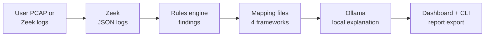

> **Archived — superseded in part (October 6, 2026).** This is the original Fall
> 2026 roadmap, kept for history. Its three contracts and conventions still
> apply, as extended in `docs/ARCHITECTURE.md`. Where this file disagrees with
> `docs/PROJECT_DECISIONS.md` or `docs/roadmap/`, those files win. The main
> differences: live capture and the switch lab are now in scope; Streamlit is
> replaced by FastAPI + HTMX; owners changed (dashboard to Ahmad, report export
> to Amory, sensor work to Jakub); and the dates were re-baselined. Follow
> `docs/roadmap/README.md` for current tasks.

# Max-Guard v2.0 — Team Roadmap (Fall 2026)

Sep 22, 2026 · @Ahmad

## How to use this roadmap

This is the only guide the team follows to ship Max-Guard v2.0 by Friday, December 4, 2026. Find your name, do your tasks in order, and tick each box when it is done. If a step fails, post the exact error in your Teams channel before you try anything else.

**What we are shipping.** A free, downloadable, fully offline compliance tool. A user uploads a PCAP file or existing Zeek logs. Zeek parses the traffic into JSON logs. Max-Guard's Python rules engine reads those logs, flags insecure activity, and maps each finding to PCI DSS v4.0.1, NIST SP 800-53 Rev. 5, CISA CPG 2.0, and CJIS v6.1. A local Ollama model explains each finding in plain English. Nothing leaves the user's machine.

**Done means.** Someone outside the team downloads v2.0 onto a clean machine, installs it, uploads a test PCAP, and gets a full report with the network unplugged.

**Out of scope for v2.0.** Live capture, a network switch lab, installers, Linux packages, VM appliances, OSCAL export. Do not build these.



Every box above runs on the user's own machine, inside Docker Compose.

### Team titles

| Person | Title | Owns | Ask for help |
| --- | --- | --- | --- |
| Ahmad Al Khoudeir | Co-Lead, Program & Compliance Lead | Scope, meetings, README, capture guide, CPG 2.0 + CJIS mapping wave, writeup, demo | Jaiden |
| Jaiden Winborne | Co-Lead, Architecture & Release Lead | Repo structure, contracts, Docker Compose, CI/CD, releases | Ahmad |
| Fiona Lau | Detection Engine Lead | Zeek runner, input adapters, core rules engine, TLS and certificate checks | Jaiden |
| Jakub Kania | Protocol Coverage Engineer | Seven-protocol coverage, cleartext rules, Zeek scripts for gaps, asset inventory | Fiona |
| Jonattan Escalante | Offline AI Engineer | Ollama integration, `--offline` enforcement, offline bundle | Jaiden |
| Ali Al-Kheder | AI Model Evaluation Engineer | Model benchmark, prompt quality, model recommendation | Jonattan |
| Amory B. | Compliance Mapping Analyst | Mapping files for all four frameworks | Ahmad |
| Karthik Nair | Test & CI Engineer | Test PCAPs, expected results, automated tests in CI | Ali |

### Timeline

| Week | Dates | Phase | Gate |
| --- | --- | --- | --- |
| 1 | Sep 21–25 | Setup | Everyone has one merged commit |
| 2 | Sep 28–Oct 2 | Contracts and checks | Three contracts merged |
| 3–5 | Oct 5–23 | Build | Fri Oct 16: one end-to-end path works |
| 6–7 | Oct 26–Nov 6 | Integration | Fri Nov 6: full report with network disabled |
| 8–9 | Nov 9–20 | Hardening | Fri Nov 13 feature freeze; Fri Nov 20 `v2.0-rc1` |
| 10 | Nov 23–27 | Thanksgiving | Fixes from the outside tester only |
| 11 | Nov 30–Dec 4 | Release | Fri Dec 4: `v2.0` tagged, presentation delivered |

CCSU finals run December 7–13, so no project work is planned after December 4. Ali is in Berlin: normally 6 hours ahead of Eastern, but only 5 hours ahead during the week of October 26.

### Rules for everyone

1. Attend the weekly 30-minute Teams meeting (time set from the availability form).
2. Post a two-sentence update in your Teams channel between meetings: what you finished, what is next.
3. Never push to `main`. Work on a branch named `yourname/short-task`, open a pull request (PR), and wait for one approval.
4. Stuck for more than two days? Say so in Teams and tag your help person from the table above.
5. Never commit real network captures from anyone else's network, passwords, or API keys.

### Git workflow used in every task

Every task below that says "open a PR" means these exact steps:

1. `git checkout main && git pull`
2. `git checkout -b yourname/short-task`
3. Make the change, then `git add <files>`
4. `git commit -m "short description of what changed"`
5. `git push -u origin yourname/short-task`
6. Open the link Git prints, click **Create pull request**, and add Jaiden or your help person as reviewer.
7. After approval, click **Squash and merge**, then `git checkout main && git pull`.

## Part 1: Everyone — Week 1 setup (Sep 21–25)

All eight people finish these steps by Friday, September 25. The exit check is one merged commit per person. Windows users: do every terminal step inside **Ubuntu on WSL2** so the commands match everyone else's.

### Step 1: Install the tools

- [ ] **Git.** Mac: open Terminal, run `xcode-select --install`, click **Install**. Windows: open PowerShell as Administrator, run `wsl --install`, restart, open **Ubuntu** from the Start menu, then run `sudo apt update && sudo apt install -y git`.
- [ ] **Docker Desktop.** Go to docker.com, click **Download Docker Desktop**, pick your OS, install, and open it. Windows: in Docker Desktop go to **Settings > Resources > WSL integration** and switch on **Ubuntu**. Give Docker at least 8 GB of memory in **Settings > Resources**.
- [ ] **Python 3.11.** Mac: `brew install python@3.11` (install Homebrew from brew.sh first if needed). Ubuntu/WSL: `sudo apt install -y python3.11 python3.11-venv`.
- [ ] **VS Code.** Download from code.visualstudio.com. Install the **Python** extension. Windows: also install the **WSL** extension and open folders with `code .` from Ubuntu.
- [ ] **Wireshark.** Download from wireshark.org. You only use it to open captures and double-check results.
- [ ] Verify everything. Run each line and confirm a version number prints:

```bash
git --version
docker --version
docker compose version
python3.11 --version
```

### Step 2: Get access and clone the repo

- [ ] Send your GitHub username to Jaiden in the Teams **General** channel. Accept the invite email from GitHub.
- [ ] Set your Git identity (use the email tied to your GitHub account):

```bash
git config --global user.name "Your Name"
git config --global user.email "you@example.com"
```

- [ ] Log in to GitHub from the terminal. Install GitHub CLI (Mac `brew install gh`; Ubuntu `sudo apt install -y gh`), then run `gh auth login`, choose **GitHub.com > HTTPS > Login with a web browser**, and paste the code shown.
- [ ] Clone and enter the repo:

```bash
mkdir -p ~/projects && cd ~/projects
git clone https://github.com/ahmadalkhoudeir/maxguard.git
cd maxguard
git status
```

`git status` must say `On branch main` and `nothing to commit, working tree clean`. If it says `not a git repository`, you are in the wrong folder.

- [ ] Create a Python virtual environment:

```bash
python3.11 -m venv .venv
source .venv/bin/activate
pip install --upgrade pip
[ -f requirements.txt ] && pip install -r requirements.txt
```

Run `source .venv/bin/activate` every time you open a new terminal for this project.

### Step 3: Run Zeek on a sample capture

- [ ] Pull the official Zeek image and check its version:

```bash
docker pull zeek/zeek:lts
docker run --rm zeek/zeek:lts zeek --version
```

Post the printed version in Teams. Jaiden will pin that exact version in Week 2.

- [ ] Make a lab folder outside the repo, so captures never get committed by accident:

```bash
mkdir -p ~/mg-lab/pcaps ~/mg-lab/logs
```

- [ ] Open wiki.wireshark.org/SampleCaptures in a browser. Scroll to the **Telnet** section and download **telnet-raw.pcap**. Scroll to **HTTP** and download **http.cap**. Move both into `~/mg-lab/pcaps/`.
- [ ] Run Zeek on the Telnet capture with JSON output and the network disabled:

```bash
cd ~/mg-lab/logs
docker run --rm --network none \
  -v ~/mg-lab/pcaps:/pcaps:ro \
  -v ~/mg-lab/logs:/logs -w /logs \
  zeek/zeek:lts \
  zeek -C -r /pcaps/telnet-raw.pcap local LogAscii::use_json=T
ls
```

What each part does: `--network none` proves Zeek works offline; `-C` ignores bad checksums common in captures; `-r` reads a file instead of a live interface; `local` loads Zeek's site policy (it adds asset logs like `known_hosts.log`); `LogAscii::use_json=T` writes one JSON object per line.

- [ ] You should see at least `conn.log`. Look at the first record: `head -n 1 conn.log`. Find the fields `id.orig_h`, `id.resp_h`, `id.resp_p`, and `service`. Write down what `service` says for port 23.
- [ ] Repeat with `http.cap` into a fresh folder (`mkdir ~/mg-lab/logs2`, change both `logs` paths to `logs2`). Confirm `http.log` appears.
- [ ] Mac with Apple Silicon only: if Docker prints a platform warning or error, add `--platform linux/amd64` right after `docker run`.

### Step 4: Make your first commit

- [ ] Create a branch: `git checkout -b yourname/add-team-entry`
- [ ] Open `docs/TEAM.md` (create it if it does not exist) and add one line in this format:

```markdown
| Your Name | Your title from the table above | GitHub username | Teams channel |
```

- [ ] Commit, push, and open a PR using the Git workflow above. Title: `Add <your name> to TEAM.md`.
- [ ] Post the PR link in Teams **General**. After Jaiden approves, click **Squash and merge**.

**Exit check, Fri Sep 25:** eight names in `docs/TEAM.md`, eight merged PRs, and eight people who have seen a JSON `conn.log` on their own machine.

## Ahmad Al Khoudeir — Co-Lead, Program & Compliance Lead

Ahmad keeps the schedule, the scope, and the people moving, and personally builds four things: the README, the capture guide, the CPG 2.0 and CJIS v6.1 mapping wave with Amory, and the final writeup and demo. He does not own any code on the critical path.

### Week 1 (Sep 21–25): Setup

- [x] **Finish the availability form.** Log in at formspree.io, click **+ New Form**, name it `Max-Guard availability`, and copy the new form ID. Open the availability form HTML, find `REPLACE_ME` (around line 280), and paste the ID in its place. Then search the file for any line that compares the ID to a placeholder (for example `=== 'REPLACE_ME'` or `=== '<your id>'`) and delete that whole `if` block, or it will block real submissions. Commit, push to the form's GitHub Pages repo, open the live page, submit one test entry, and confirm it appears in Formspree.
- [x] **Send the form.** Post the live link in Teams **General** with a Wednesday 11:59 PM deadline.
- [ ] **Create the Teams team.** In Microsoft Teams click **Teams** in the left bar, then **Join or create a team > Create team > From scratch > Private**. Name it `Max-Guard v2.0`. Add all seven teammates by CCSU email. Then, for each channel, click **...** next to the team name > **Add channel**: `General` (exists already), `Engine`, `AI`, `Mapping`, `Testing`, `Releases`.
- [ ] **Schedule the weekly meeting.** Thursday morning, read the form results and pick the slot with the most "yes" answers that includes Ali. In Teams go to **Calendar > New meeting**, set the title `Max-Guard weekly`, set 30 minutes, set **Repeat: Weekly** until Dec 4, and in **Add channel** pick `General`. In the description write: "Week of Oct 26: Berlin is 5 hours ahead instead of 6."
- [ ] **Write the scope document.** Create `docs/SCOPE.md` with these exact sections: *In scope* (the seven protocols FTP, Telnet, HTTP, POP3, IMAP, RDP, HTTP-Alt 8080; TLS version, cipher, and certificate checks; four frameworks; PCAP upload and Zeek log import; Docker Compose plus the offline bundle; asset inventory; evidence links). *Out of scope* (live capture, installers, Linux packages, VM appliance, OSCAL, cloud AI APIs). *Definition of done* (copy the "Done means" sentence from the top of this roadmap). Open a PR and ask Jaiden to review.
- [ ] **Send week-1 check-ins** as private Teams chats: Jakub, "What Python have you written before? Classes, file I/O, pytest?"; Jonattan, "What are your top two interests in the project, and when do you graduate?"; Ali, "Are you enrolled this semester, and when do you graduate?" Record answers in a private note.
- [ ] **Run the kickoff meeting** (30 minutes). Agenda: 5 min, what Max-Guard is (share the diagram above); 10 min, walk through the team titles table; 10 min, everyone shares their Step 3 result; 5 min, questions. Post a recording or notes in **General**.

### Week 2 (Sep 28–Oct 2): Contracts and checks

- [ ] **License review.** Open these pages and note each license: Zeek (BSD license, in the zeek/zeek GitHub repo `COPYING` file), Ollama (MIT, in the ollama/ollama repo `LICENSE` file), Streamlit (Apache 2.0), and each model Ali shortlists (read the license on the model's ollama.com/library page). Post a four-line summary in **Releases**: tool, license, can we redistribute it in our offline bundle (yes/no), any attribution we must include.
- [ ] **NIST session with Amory** (30 minutes on Teams). Open the NIST SP 800-53 Rev. 5 page (link in References), download the PDF, and walk Amory through one control, SC-8 *Transmission Confidentiality and Integrity*: the control statement, the discussion, and the enhancement SC-8(1). Show how "Telnet sends passwords in cleartext" maps to SC-8. Then do the same with PCI DSS v4.0.1 Requirement 4.2.1.
- [ ] **README skeleton.** Create or replace `README.md` with these headings, each with one placeholder sentence: What Max-Guard is; What it is not (not a scanner like Nmap, no live capture in v2.0); Quick start (Docker); Offline install; How to capture your traffic; Supported checks; Frameworks; Privacy (nothing leaves your machine); Contributing; License. Open a PR.
- [ ] **Collect week-2 results** with Jaiden: Fiona (does Zeek read `.pcapng`?), Jakub (which Zeek log or field identifies Telnet, POP3, IMAP?), Jonattan (does Ollama answer with networking disabled?). Post the three answers in **General** by Friday.

### Weeks 3–5 (Oct 5–23): Build

- [ ] **Run every weekly meeting** with three questions per person: What moved? What is stuck? What do you need? Keep it to 30 minutes. Post three-line notes after each meeting.
- [ ] **Follow up privately** with anyone who has not posted an update in 5 days: "Hey, anything blocking you? Happy to pair."
- [ ] **Start the findings log.** Create `docs/writeup/findings-log.md`. Every week add dated entries: decisions made, problems hit, what fixed them. This becomes the writeup.
- [ ] **Write the capture guide** in `README.md` under *How to capture your traffic*. Include: (1) only capture networks you own or are authorized to monitor; (2) Wireshark method: open Wireshark, double-click your interface, let it run, click the red square, then **File > Save As** and pick `pcapng`; (3) tcpdump method: `sudo tcpdump -i <interface> -s 0 -w capture.pcap` and press Ctrl+C to stop; list interfaces with `tcpdump -D`; (4) typical size guidance (start with 5–15 minutes of traffic); (5) how to upload it into Max-Guard. Ask Karthik to follow the guide on his machine and report anything unclear.
- [ ] **Checkpoint, Fri Oct 16, with Jaiden.** Watch a live demo: a test PCAP goes in, Zeek runs, at least one finding appears, it maps to PCI DSS and NIST, Ollama writes an explanation, and the dashboard shows it. Record pass or fail in the findings log. If it fails, list the missing piece and its owner in **General** the same day.

### Weeks 6–7 (Oct 26–Nov 6): Integration

- [ ] Remind Ali in Teams on Monday Oct 26 that the meeting is one hour earlier for him this week.
- [ ] **Protect the schedule.** Any new-feature request gets the reply: "Great idea for v2.1. Please add it to `docs/ROADMAP-v2.1.md`." Create that file with a heading if it does not exist.
- [ ] **Unblock fast.** Check every Teams channel daily. Any question older than 24 hours gets an answer or a named person to answer it.
- [ ] **Line up the outside tester.** Ask one classmate or faculty member who has never seen Max-Guard to test it on Nov 20 for one hour. Confirm the date in writing.
- [ ] **Exit check, Fri Nov 6:** with Jaiden and Jonattan, watch the full report generate with networking disabled. Record the result.

### Weeks 8–9 (Nov 9–20): Hardening

- [ ] **Announce the feature freeze** in **General** on Monday Nov 9: "Freeze is Friday Nov 13 at 11:59 PM. After that, bug fixes only." On Nov 14, ask Jaiden to require a `bug` label on every PR.
- [ ] **Mapping wave 2 with Amory.** Work through CISA CPG 2.0 and CJIS v6.1 together (Amory's section lists the steps). Your job: explain the government context, review every row Amory writes, and sign off in the PR.
- [ ] **Finish the README and capture guide.** Replace every placeholder sentence. Have one teammate who did not write it follow the Quick start from scratch.
- [ ] **Draft the writeup** in `docs/writeup/writeup.md`: problem, why passive analysis plus compliance mapping, architecture (reuse the diagram), what each person built, results (Karthik's test numbers, Ali's model table), limitations, v2.1 plans.
- [ ] **Draft the demo script**: 4 minutes. 0:00–0:30 the problem; 0:30–1:00 install from the offline bundle; 1:00–2:30 upload a PCAP and walk through two findings; 2:30–3:30 unplug the network and show it still works; 3:30–4:00 credits.
- [ ] **Hand `v2.0-rc1` to the outside tester** on Nov 20. Give them only the GitHub Release link and the README. Sit with them, say nothing, and write down every place they get stuck. Post the list in **General** as issues.
- [ ] **Succession.** Ask Jonattan and Ali directly if they graduate in December. If yes, name a successor for their workstream in `docs/TEAM.md` before Nov 20.

### Week 10 (Nov 23–27): Thanksgiving

- [ ] Make the meeting optional. Triage the outside tester's issues: label each `must-fix` or `v2.1`, and assign every `must-fix` to an owner.

### Week 11 (Nov 30–Dec 4): Release

- [ ] **Record the demo video** with the script. Use OBS Studio (obsproject.com) or the built-in recorder (Mac: Shift+Command+5; Windows: Win+Alt+R with Xbox Game Bar). Keep it under 4 minutes. Upload it and link it in the README.
- [ ] **Finalize the writeup and presentation.** Add the References section with APA 7 citations for every framework used.
- [ ] **LinkedIn post** after the Release is public: what Max-Guard does, the offline angle, the download link, and every contributor tagged by name.
- [ ] **Final check, Fri Dec 4:** the acceptance test at the end of this roadmap passes and the presentation is delivered.

## Jaiden Winborne — Co-Lead, Architecture & Release Lead

Jaiden owns the shape of the code and the path to a download: repo structure, the three contracts, Docker Compose, CI, and the GitHub Release. Every other builder codes against the contracts he merges in Week 2, so those land first.

### Week 1 (Sep 21–25): Repo structure and guardrails

- [ ] **Invite everyone.** On github.com open the repo, go to **Settings > Collaborators > Add people**, and add each GitHub username posted in Teams with the **Write** role.
- [ ] **Restructure the repo.** On a branch `jaiden/restructure`, create this layout (move old Scapy and OpenAI code into `legacy/` so nothing is lost, then delete `legacy/` at the freeze):

```text
maxguard/                 # engine library (Python package)
  __init__.py
  models.py               # Finding dataclass (contract 1)
  adapters/               # input adapters (contract 3)
  zeek/                   # Zeek runner + custom .zeek scripts
  rules/                  # one file per rule family
  mapping/                # mapping loader (reads contract 2 files)
  ai/                     # Ollama client
  inventory.py            # asset inventory
  report.py               # JSON/CSV/HTML export
cli/main.py               # `maxguard analyze ...`
dashboard/app.py          # Streamlit UI
mappings/                 # one YAML per framework
tests/unit/  tests/integration/  tests/pcaps/  tests/expected/
docker/Dockerfile  docker/compose.yaml
docs/
```

- [ ] **Add `pyproject.toml`** so `pip install -e .` works for everyone:

```toml
[project]
name = "maxguard"
version = "0.1.0"
requires-python = ">=3.11"
dependencies = ["pyyaml>=6", "requests>=2.31", "streamlit>=1.40", "pandas>=2"]

[project.optional-dependencies]
dev = ["pytest>=8", "ruff>=0.6"]

[project.scripts]
maxguard = "cli.main:main"

[tool.setuptools.packages.find]
include = ["maxguard*", "cli*"]
```

Then tell the team to run `pip install -e ".[dev]"` inside their virtual environment.

- [ ] **Branch protection.** Go to **Settings > Rules > Rulesets > New ruleset > New branch ruleset**. Name `main-protection`, enforcement **Active**, target **Include default branch**. Tick **Restrict deletions**, **Block force pushes**, **Require a pull request before merging** (1 approval), and **Require status checks to pass** (add `test` after the first CI run exists). Click **Create**.
- [ ] **CI skeleton.** Create `.github/workflows/ci.yml`:

```yaml
name: ci
on: [pull_request, push]
jobs:
  test:
    runs-on: ubuntu-latest
    steps:
      - uses: actions/checkout@v4
      - uses: actions/setup-python@v5
        with: { python-version: "3.11" }
      - run: pip install -e ".[dev]"
      - run: ruff check .
      - run: pytest -q
```

- [ ] **`CONTRIBUTING.md`** with: branch naming (`name/task`), one approval to merge, run `ruff check .` and `pytest -q` before pushing, never commit captures from real networks, and where each contract lives.
- [ ] Help anyone stuck on Part 1. Merge the eight `TEAM.md` PRs.

### Week 2 (Sep 28–Oct 2): The three contracts

Write each contract as code plus a short doc in `docs/contracts.md`, merge by Wednesday Sep 30, and announce it in **General**. After this, changing a contract needs a PR approved by both co-leads.

- [ ] **Contract 1: the event format** in `maxguard/models.py`:

```python
from dataclasses import dataclass, field, asdict

SEVERITIES = ("critical", "high", "medium", "low", "info")

@dataclass
class Evidence:
    log: str          # e.g. "conn.log"
    uid: str          # Zeek connection uid, links back to the raw record
    ts: float         # Zeek timestamp (epoch seconds)

@dataclass
class Control:
    framework: str    # "PCI DSS", "NIST SP 800-53", "CISA CPG", "CJIS"
    version: str      # "4.0.1", "Rev. 5", "2.0", "6.1"
    control_id: str   # "4.2.1", "SC-8", ...
    title: str
    rationale: str

@dataclass
class Finding:
    rule_id: str              # stable key, e.g. "cleartext.telnet"
    title: str
    severity: str             # one of SEVERITIES
    src_ip: str
    dst_ip: str
    dst_port: int
    protocol: str             # "telnet", "tls", ...
    first_seen: float
    last_seen: float
    count: int = 1
    details: dict = field(default_factory=dict)
    evidence: list[Evidence] = field(default_factory=list)
    controls: list[Control] = field(default_factory=list)  # filled by mapping
    explanation: str | None = None                         # filled by Ollama

    def to_dict(self) -> dict:
        return asdict(self)
```

Rules: rules only fill fields up to `evidence`. The mapping layer fills `controls`. The AI layer fills `explanation`. One `Finding` per unique (`rule_id`, `src_ip`, `dst_ip`, `dst_port`); repeats raise `count` and widen `first_seen`/`last_seen`.

- [ ] **Contract 2: the mapping file schema.** One file per framework in `mappings/`, keyed by `rule_id`:

```yaml
framework: "PCI DSS"
version: "4.0.1"
source: "https://www.pcisecuritystandards.org/document_library/"
mappings:
  cleartext.telnet:
    - control_id: "4.2.1"
      title: "Strong cryptography protects PAN during transmission over open, public networks"
      rationale: "Telnet sends credentials and session data unencrypted."
```

Add `mappings/schema.md` explaining each field, and a test `tests/unit/test_mappings.py` that loads every YAML file and fails if a key is missing or a `rule_id` is not in the rule registry.

- [ ] **Contract 3: the input adapter interface** in `maxguard/adapters/base.py`:

```python
from pathlib import Path
from typing import Iterator, Protocol

class InputAdapter(Protocol):
    name: str
    def accepts(self, path: Path) -> bool: ...
    def to_zeek_logs(self, path: Path, workdir: Path) -> Path:
        """Return a directory of Zeek JSON logs (one object per line)."""

def read_log(log_dir: Path, log_name: str) -> Iterator[dict]:
    """Yield records from e.g. conn.log; yield nothing if the file is absent."""
    import json
    p = log_dir / log_name
    if not p.exists():
        return
    with p.open() as f:
        for line in f:
            line = line.strip()
            if line and not line.startswith("#"):
                yield json.loads(line)
```

Fiona builds `PcapAdapter` and `ZeekLogAdapter` against this. Every rule reads logs only through `read_log`.

- [ ] **Pin the Zeek version.** Take the version the team posted in Week 1 and use that exact tag (not `lts`) everywhere. Record it in `docs/contracts.md`.
- [ ] **Docker Compose skeleton.** Create `docker/Dockerfile`:

```dockerfile
FROM zeek/zeek:<PINNED_VERSION>
RUN apt-get update && apt-get install -y --no-install-recommends python3 python3-venv \
    && rm -rf /var/lib/apt/lists/*
WORKDIR /app
COPY pyproject.toml ./
COPY maxguard ./maxguard
COPY cli ./cli
COPY dashboard ./dashboard
COPY mappings ./mappings
COPY .streamlit ./.streamlit
RUN python3 -m venv /opt/venv && /opt/venv/bin/pip install --no-cache-dir .
ENV PATH="/opt/venv/bin:$PATH"
EXPOSE 8501
CMD ["streamlit", "run", "dashboard/app.py"]
```

Then `docker/compose.yaml`:

```yaml
services:
  maxguard:
    build: { context: .., dockerfile: docker/Dockerfile }
    ports: ["127.0.0.1:8501:8501"]     # reachable only from this computer
    environment:
      OLLAMA_HOST: "http://ollama:11434"
      MAXGUARD_OFFLINE: "1"
    networks: [ui, ai]
    depends_on: [ollama]
  ollama:
    image: ollama/ollama:<PINNED_VERSION>
    volumes: ["ollama-models:/root/.ollama"]
    networks: [ai]                       # internal network: no internet access
networks:
  ui: {}
  ai: { internal: true }
volumes:
  ollama-models: {}
```

Why two networks: a container that sits only on an `internal: true` network cannot reach the internet, so Ollama is sealed. The `maxguard` container also needs the `ui` network so the dashboard port can be published to `127.0.0.1`; its own outbound traffic is blocked by Jonattan's `--offline` guard.

- [ ] **Streamlit privacy settings.** Create `.streamlit/config.toml`:

```toml
[browser]
gatherUsageStats = false

[server]
address = "0.0.0.0"      # inside the container; the host side is bound to 127.0.0.1
headless = true
maxUploadSize = 1024     # MB, so real captures fit
```

- [ ] Test it: `cd docker && docker compose up --build`, open http://127.0.0.1:8501, then from another computer on your Wi-Fi confirm the page does not load.

### Weeks 3–5 (Oct 5–23): Build support

- [ ] Review every PR within 24 hours with Fiona. Check that code uses the contracts, has a test, and passes CI.
- [ ] Keep CI green. If `main` goes red, fix it or revert the PR that broke it the same day.
- [ ] Wire services as they arrive: Fiona's runner into the Dockerfile, Jonattan's Ollama client into `maxguard`, the dashboard upload page into the pipeline.
- [ ] Write `maxguard/pipeline.py` with one function the CLI and dashboard both call:

```python
def analyze(path, workdir, frameworks=None, explain=True) -> dict:
    # 1) pick adapter  2) get Zeek logs  3) run all rules  4) apply mappings
    # 5) build inventory  6) ask Ollama for explanations  7) return report dict
    ...
```

- [ ] **Checkpoint, Fri Oct 16, with Ahmad:** demo the end-to-end path.

### Weeks 6–7 (Oct 26–Nov 6): Integration lead

- [ ] Merge the workstreams. Fix contract mismatches by changing the caller, not the contract.
- [ ] Run everything only through `docker compose up`. No one demos from a laptop-only setup after Oct 30.
- [ ] With Jonattan, run the network-disabled test (his section has the steps). **Exit check, Fri Nov 6.**

### Weeks 8–9 (Nov 9–20): Automated releases

- [ ] Create `.github/workflows/release.yml` that runs on tags matching `v*`: check out, log in to GitHub Container Registry with `docker/login-action` using `${{ secrets.GITHUB_TOKEN }}`, then build and push `ghcr.io/ahmadalkhoudeir/maxguard:${{ github.ref_name }}` with `docker/build-push-action` (`file: docker/Dockerfile`, platforms `linux/amd64,linux/arm64`). Give the job `permissions: packages: write, contents: write`.
- [ ] Change `compose.yaml` to use `image: ghcr.io/ahmadalkhoudeir/maxguard:v2.0` instead of `build:` for the release copy (keep a `compose.dev.yaml` with `build:` for the team).
- [ ] Delete `legacy/` after the freeze on Nov 13.
- [ ] **Tag the release candidate on Fri Nov 20:** `git checkout main && git pull && git tag v2.0-rc1 && git push origin v2.0-rc1`. Confirm the workflow run is green in the **Actions** tab.

### Week 10 (Nov 23–27)

- [ ] Review and merge only `must-fix` PRs from the outside tester's list.

### Week 11 (Nov 30–Dec 4): Release

- [ ] Tag `v2.0` the same way as the release candidate.
- [ ] On github.com go to **Releases > Draft a new release**, choose tag `v2.0`, title `Max-Guard v2.0`. Attach Jonattan's offline bundle file and a `SHA256SUMS.txt` made with `shasum -a 256 maxguard-offline-v2.0.tar.gz > SHA256SUMS.txt`. Paste the install steps from the README. Click **Publish release**.
- [ ] Write `docs/ARCHITECTURE.md`: the diagram, each module's job, the three contracts, and how to add a rule, a framework, and a test (link to the teammates' guides).

## Fiona Lau — Detection Engine Lead

Fiona builds the heart of Max-Guard: the code that turns a PCAP or a folder of Zeek logs into a list of `Finding` objects. She owns the Zeek runner, both input adapters, the rule registry, the TLS and certificate rules, and the CLI. She is also the second reviewer on every engine PR.

### Weeks 1–2 (Sep 21–Oct 2): Prove Zeek handles our inputs

- [ ] Finish Part 1.
- [ ] **Test `.pcapng`.** Open Wireshark, open `~/mg-lab/pcaps/http.cap`, click **File > Save As**, choose **pcapng**, save as `http.pcapng`. Run the Part 1 Zeek command on `http.pcapng` into a new folder `~/mg-lab/logs-ng`. Compare: `wc -l ~/mg-lab/logs2/http.log ~/mg-lab/logs-ng/http.log` must print the same line count.
- [ ] **Test a TLS capture.** Download a TLS sample from the **SSL with decryption keys** or **TLS** section of wiki.wireshark.org/SampleCaptures, run Zeek on it, and open `ssl.log` and `x509.log`. Write down the exact field names your pinned Zeek version uses for: TLS version, cipher, server name, the certificate fingerprints in `ssl.log`, and in `x509.log` the fingerprint, subject, issuer, `not_valid_after`, key length, and signature algorithm.
- [ ] Post both results in **Engine** by Friday Oct 2. Put the field list in `docs/zeek-fields.md` via a PR, because Jakub and Karthik will use it.

### Week 3 (Oct 5–9): Zeek runner and adapters

- [ ] Branch `fiona/zeek-runner`. Create `maxguard/zeek/runner.py`:

```python
import subprocess
from pathlib import Path

SCRIPTS_DIR = Path(__file__).parent / "scripts"

class ZeekError(RuntimeError):
    pass

def run_zeek(pcap: Path, out_dir: Path, timeout: int = 1800) -> Path:
    """Run Zeek on one capture file and write JSON logs into out_dir."""
    out_dir.mkdir(parents=True, exist_ok=True)
    extra = sorted(str(p) for p in SCRIPTS_DIR.glob("*.zeek"))  # Jakub's scripts
    cmd = ["zeek", "-C", "-r", str(pcap.resolve()), "local",
           "LogAscii::use_json=T", *extra]
    res = subprocess.run(cmd, cwd=out_dir, capture_output=True,
                         text=True, timeout=timeout)
    if res.returncode != 0:
        raise ZeekError(res.stderr.strip() or "zeek failed")
    if not (out_dir / "conn.log").exists():
        raise ZeekError("Zeek produced no conn.log: is this a valid capture?")
    return out_dir
```

- [ ] Create `maxguard/adapters/pcap.py`:

```python
from pathlib import Path
from maxguard.zeek.runner import run_zeek

PCAP_MAGIC = {b"\xd4\xc3\xb2\xa1", b"\xa1\xb2\xc3\xd4",   # pcap
              b"\x4d\x3c\xb2\xa1", b"\xa1\xb2\x3c\x4d",   # pcap (ns)
              b"\x0a\x0d\x0d\x0a"}                       # pcapng

class PcapAdapter:
    name = "pcap"
    def accepts(self, path: Path) -> bool:
        if not path.is_file():
            return False
        with path.open("rb") as f:
            return f.read(4) in PCAP_MAGIC
    def to_zeek_logs(self, path: Path, workdir: Path) -> Path:
        return run_zeek(path, workdir / "zeek_logs")
```

Checking the file's first four bytes (its "magic number") is safer than trusting the extension.

- [ ] Create `maxguard/adapters/zeeklogs.py`. It accepts a directory containing `conn.log`, or a `.zip`/`.tar.gz` of one. It must handle both JSON logs and Zeek's default tab-separated (TSV) logs, because some teams run Zeek without JSON:

```python
import json, shutil, tarfile, zipfile
from pathlib import Path

def _tsv_to_json(src: Path, dst: Path) -> None:
    fields, sep = None, "\t"
    with src.open() as fin, dst.open("w") as fout:
        for line in fin:
            line = line.rstrip("\n")
            if line.startswith("#fields"):
                fields = line.split(sep)[1:]
            elif line.startswith("#") or not line:
                continue
            elif fields:
                vals = [None if v in ("-", "(empty)") else v for v in line.split(sep)]
                fout.write(json.dumps(dict(zip(fields, vals))) + "\n")

class ZeekLogAdapter:
    name = "zeek-logs"
    def accepts(self, path: Path) -> bool:
        return (path.is_dir() and (path / "conn.log").exists()) or \
               path.suffix == ".zip" or path.name.endswith(".tar.gz")
    def to_zeek_logs(self, path: Path, workdir: Path) -> Path:
        src = workdir / "imported"
        if path.is_dir():
            shutil.copytree(path, src, dirs_exist_ok=True)
        elif path.suffix == ".zip":
            zipfile.ZipFile(path).extractall(src)
        else:
            tarfile.open(path).extractall(src, filter="data")
        out = workdir / "zeek_logs"
        out.mkdir(parents=True, exist_ok=True)
        for log in src.rglob("*.log"):
            first = log.open().readline()
            if first.startswith("{"):
                shutil.copy(log, out / log.name)
            else:
                _tsv_to_json(log, out / log.name)
        return out
```

Note: TSV values come back as strings. Rules must convert numbers themselves (for example `int(rec["id.resp_p"])`).

- [ ] Write `tests/unit/test_adapters.py`: the pcap adapter accepts a pcap and a pcapng and rejects a `.txt`; the Zeek-log adapter converts a three-line TSV `conn.log` fixture into three JSON lines. Run `pytest -q`, open a PR.

### Week 4 (Oct 12–16): Rule registry and TLS rules

- [ ] Create `maxguard/rules/base.py`:

```python
from pathlib import Path
from typing import Callable
from maxguard.models import Finding, Evidence

RULES: dict[str, Callable[[Path], list[Finding]]] = {}

def rule(rule_id: str):
    def wrap(fn):
        RULES[rule_id] = fn
        return fn
    return wrap

def merge(findings: list[Finding]) -> list[Finding]:
    """Collapse duplicates per the event-format rule (Contract 1)."""
    out: dict[tuple, Finding] = {}
    for f in findings:
        key = (f.rule_id, f.src_ip, f.dst_ip, f.dst_port)
        if key in out:
            g = out[key]
            g.count += f.count
            g.first_seen = min(g.first_seen, f.first_seen)
            g.last_seen = max(g.last_seen, f.last_seen)
            g.evidence.extend(f.evidence[:5 - len(g.evidence)])  # keep 5 max
        else:
            out[key] = f
    return list(out.values())

def run_all(log_dir: Path) -> list[Finding]:
    found = []
    for fn in RULES.values():
        found.extend(fn(log_dir))
    return merge(found)
```

- [ ] Create `maxguard/rules/tls.py` with two rules. Use the field names from your `docs/zeek-fields.md`; the ones below are Zeek's usual names:

```python
from maxguard.adapters.base import read_log
from maxguard.models import Finding, Evidence
from maxguard.rules.base import rule

WEAK_VERSIONS = {"SSLv2", "SSLv3", "TLSv10", "TLSv11"}
WEAK_CIPHER_MARKERS = ("_NULL_", "_EXPORT", "_RC4_", "_DES_", "_3DES_", "_anon_")

def _finding(rec, rule_id, title, severity, details):
    return Finding(rule_id=rule_id, title=title, severity=severity,
                   src_ip=rec["id.orig_h"], dst_ip=rec["id.resp_h"],
                   dst_port=int(rec["id.resp_p"]), protocol="tls",
                   first_seen=float(rec["ts"]), last_seen=float(rec["ts"]),
                   details=details,
                   evidence=[Evidence("ssl.log", rec["uid"], float(rec["ts"]))])

@rule("tls.weak_version")
def weak_version(log_dir):
    return [_finding(r, "tls.weak_version", f"Outdated protocol {r['version']}",
                     "high", {"version": r["version"], "server_name": r.get("server_name")})
            for r in read_log(log_dir, "ssl.log") if r.get("version") in WEAK_VERSIONS]

@rule("tls.weak_cipher")
def weak_cipher(log_dir):
    return [_finding(r, "tls.weak_cipher", f"Weak cipher {r['cipher']}",
                     "high", {"cipher": r["cipher"]})
            for r in read_log(log_dir, "ssl.log")
            if r.get("cipher") and any(m in r["cipher"] for m in WEAK_CIPHER_MARKERS)]
```

- [ ] Import the rule modules in `maxguard/rules/__init__.py` (`from . import tls, cleartext, certs`) so the decorators register them.
- [ ] Unit tests with a hand-written `ssl.log` fixture in `tests/fixtures/`: one TLSv10 record must produce one `tls.weak_version`; one TLSv13 record must produce nothing.
- [ ] **Checkpoint, Fri Oct 16:** your TLS rule must show up in the end-to-end demo.

### Week 5 (Oct 19–23): CLI

- [ ] Create `cli/main.py` so people can run Max-Guard without the dashboard:

```python
import argparse, json, sys, tempfile
from pathlib import Path
from maxguard.pipeline import analyze

def main():
    p = argparse.ArgumentParser(prog="maxguard")
    sub = p.add_subparsers(dest="cmd", required=True)
    a = sub.add_parser("analyze", help="Analyze a PCAP or a Zeek log folder")
    a.add_argument("input", type=Path)
    a.add_argument("-o", "--output", type=Path, default=Path("maxguard-report.json"))
    a.add_argument("--no-ai", action="store_true", help="Skip Ollama explanations")
    a.add_argument("--offline", action="store_true", help="Fail on any outbound connection")
    args = p.parse_args()
    with tempfile.TemporaryDirectory() as tmp:
        report = analyze(args.input, Path(tmp), explain=not args.no_ai)
    args.output.write_text(json.dumps(report, indent=2))
    print(f"{len(report['findings'])} findings written to {args.output}")
    return 0

if __name__ == "__main__":
    sys.exit(main())
```

(Jonattan hooks `--offline` into his guard in Week 5.) Test: `maxguard analyze tests/pcaps/telnet.pcap --no-ai` inside the container.

### Weeks 6–7 (Oct 26–Nov 6): Integration

- [ ] Make sure every rule returns only `Finding` objects that follow Contract 1. Run `python -c "from maxguard.rules.base import RULES; print(sorted(RULES))"` and confirm every rule is listed.
- [ ] Fix integration bugs Jaiden assigns you within 48 hours.
- [ ] Run your rules against all of Karthik's test PCAPs and fix every mismatch with his expected results.

### Weeks 8–9 (Nov 9–20): Certificates and accuracy

- [ ] Create `maxguard/rules/certs.py` using `x509.log`, linked to `ssl.log` by certificate fingerprint (confirm the linking fields in `docs/zeek-fields.md`). Rules, all before the freeze on Nov 13:
  - `cert.expired`: `not_valid_after` earlier than the capture time. Severity high.
  - `cert.self_signed`: subject equals issuer on a leaf certificate. Severity medium.
  - `cert.weak_key`: RSA key length under 2048. Severity high.
  - `cert.sha1_signature`: signature algorithm contains `sha1`. Severity medium.
- [ ] Unit test each rule with a fixture line.
- [ ] Accuracy pass with Karthik: for every false positive or missed finding in his 30+ tests, fix the rule or document why it is expected.
- [ ] Review every engine PR until Nov 20.

### Week 11 (Nov 30–Dec 4): Documentation

- [ ] Write `docs/engine.md`: how a file flows through the adapters, runner, rules, and merge; how to write a new rule in five steps (create function, add `@rule`, return `Finding`s, add fixture test, add mapping rows); and the list of all TLS and certificate rules with their severity.

## Jakub Kania — Protocol Coverage Engineer

Jakub makes sure all seven legacy protocols are detected, writes the cleartext rules and the Zeek scripts that fill Zeek's gaps, builds the asset inventory, and builds the dashboard pages. His help person is Fiona.

### Rule ID registry (shared by everyone)

These IDs are final. Rules use them, Amory maps them, and Karthik tests them. Adding one needs a PR approved by Jaiden.

| rule\_id | Owner | Source log | Severity |
| --- | --- | --- | --- |
| `cleartext.ftp` | Jakub | ftp.log | high |
| `cleartext.telnet` | Jakub | maxguard\_cleartext.log | high |
| `cleartext.http` | Jakub | http.log (port not 8080) | medium |
| `cleartext.http_alt` | Jakub | http.log (port 8080) | medium |
| `cleartext.pop3` | Jakub | maxguard\_cleartext.log | high |
| `cleartext.imap` | Jakub | maxguard\_cleartext.log | high |
| `rdp.standard_security` | Jakub | rdp.log | high |
| `tls.weak_version` | Fiona | ssl.log | high |
| `tls.weak_cipher` | Fiona | ssl.log | high |
| `cert.expired` | Fiona | x509.log | high |
| `cert.self_signed` | Fiona | x509.log | medium |
| `cert.weak_key` | Fiona | x509.log | high |
| `cert.sha1_signature` | Fiona | x509.log | medium |

### Weeks 1–2 (Sep 21–Oct 2): Coverage checklist

- [ ] Finish Part 1.
- [ ] Go to wiki.wireshark.org/SampleCaptures and download one capture each for FTP, POP3, IMAP, and RDP (you already have Telnet and HTTP). Put them in `~/mg-lab/pcaps/`.
- [ ] Run Zeek on each one (Part 1 command, one output folder per capture). For each, run `ls` and `grep -h '"service"' conn.log | head -3`.
- [ ] Fill in `docs/coverage.md` with this table and open a PR:

| Protocol | Port | Dedicated Zeek log? | conn.log `service` value | Gap to fill? |
| --- | --- | --- | --- | --- |
| FTP | 21 |  |  |  |
| Telnet | 23 |  |  |  |
| HTTP | 80 |  |  |  |
| POP3 | 110 |  |  |  |
| IMAP | 143 |  |  |  |
| RDP | 3389 |  |  |  |
| HTTP-Alt | 8080 |  |  |  |

Expect this: FTP, HTTP, and RDP have their own logs (`ftp.log`, `http.log`, `rdp.log`). Zeek has POP3, IMAP, and Telnet ("Login") analyzers but no dedicated log for them, so those three are the gaps you fill with a script. Confirm this on your pinned version rather than trusting it.

### Week 3 (Oct 5–9): Zeek script for the gaps

- [ ] Branch `jakub/cleartext-script`. Create `maxguard/zeek/scripts/cleartext.zeek`:

```zeek
module MaxGuard;

export {
    redef enum Log::ID += { LOG };

    type Info: record {
        ts:      time    &log;
        uid:     string  &log;
        id:      conn_id &log;
        service: string  &log &optional;
        proto:   string  &log;
    };

    const cleartext_ports: table[port] of string = {
        [23/tcp]  = "telnet",
        [110/tcp] = "pop3",
        [143/tcp] = "imap",
    } &redef;
}

event zeek_init()
    {
    Log::create_stream(MaxGuard::LOG, [$columns=Info, $path="maxguard_cleartext"]);
    }

event connection_state_remove(c: connection)
    {
    if ( c$id$resp_p !in cleartext_ports )
        return;
    if ( c$resp$size == 0 )          # no data from server: a scan, not a session
        return;
    local svc = "";
    if ( c?$service && |c$service| > 0 )
        svc = join_string_set(c$service, ",");
    if ( /ssl|tls/ in svc )          # STARTTLS upgraded: encrypted, skip
        return;
    Log::write(MaxGuard::LOG, [$ts=network_time(), $uid=c$uid, $id=c$id,
                               $service=svc, $proto=cleartext_ports[c$id$resp_p]]);
    }
```

- [ ] Check it parses: `docker run --rm -v "$PWD/maxguard/zeek/scripts:/s:ro" zeek/zeek:<PINNED> zeek -a /s/cleartext.zeek`. No output means no syntax errors.
- [ ] Run it on the Telnet capture by adding `/s/cleartext.zeek` to the end of the Part 1 command (and the `-v` mount). Confirm `maxguard_cleartext.log` appears with one line per Telnet session. Repeat for POP3 and IMAP.
- [ ] Fiona's runner loads every `.zeek` file in that folder automatically. Open a PR.

### Week 4 (Oct 12–16): Cleartext rules

- [ ] Create `maxguard/rules/cleartext.py`:

```python
from maxguard.adapters.base import read_log
from maxguard.models import Finding, Evidence
from maxguard.rules.base import rule

def _f(rec, rule_id, title, sev, proto, log, details=None):
    ts = float(rec["ts"])
    return Finding(rule_id=rule_id, title=title, severity=sev,
                   src_ip=rec["id.orig_h"], dst_ip=rec["id.resp_h"],
                   dst_port=int(rec["id.resp_p"]), protocol=proto,
                   first_seen=ts, last_seen=ts, details=details or {},
                   evidence=[Evidence(log, rec["uid"], ts)])

@rule("cleartext.ftp")
def ftp(d):
    return [_f(r, "cleartext.ftp", "FTP login and data sent unencrypted", "high",
               "ftp", "ftp.log", {"user": r.get("user"), "command": r.get("command")})
            for r in read_log(d, "ftp.log")]

@rule("cleartext.http")
def http(d):
    return [_f(r, "cleartext.http", "Unencrypted HTTP", "medium", "http", "http.log",
               {"host": r.get("host"), "uri": r.get("uri"), "basic_auth_user": r.get("username")})
            for r in read_log(d, "http.log") if int(r["id.resp_p"]) != 8080]

@rule("cleartext.http_alt")
def http_alt(d):
    return [_f(r, "cleartext.http_alt", "Unencrypted HTTP on port 8080", "medium",
               "http", "http.log", {"host": r.get("host")})
            for r in read_log(d, "http.log") if int(r["id.resp_p"]) == 8080]

def _from_script(proto, rule_id, title):
    def check(d):
        return [_f(r, rule_id, title, "high", proto, "maxguard_cleartext.log")
                for r in read_log(d, "maxguard_cleartext.log") if r["proto"] == proto]
    return check

rule("cleartext.telnet")(_from_script("telnet", "cleartext.telnet", "Telnet session in cleartext"))
rule("cleartext.pop3")(_from_script("pop3", "cleartext.pop3", "POP3 mail retrieval in cleartext"))
rule("cleartext.imap")(_from_script("imap", "cleartext.imap", "IMAP mail access in cleartext"))

@rule("rdp.standard_security")
def rdp(d):
    return [_f(r, "rdp.standard_security", "RDP using legacy Standard RDP Security", "high",
               "rdp", "rdp.log", {"security_protocol": r.get("security_protocol")})
            for r in read_log(d, "rdp.log") if r.get("security_protocol") == "RDP"]
```

- [ ] Write one unit test per rule with a small fixture log in `tests/fixtures/`. Include a negative case for each (for example an IMAP connection with `service` = `imap,ssl` must not appear).
- [ ] Confirm on the RDP capture which values `security_protocol` takes (`RDP`, `SSL`, `HYBRID`, ...) and adjust the check if your version differs.
- [ ] **Checkpoint, Fri Oct 16:** the Telnet finding is the one the team demos.

### Week 5 (Oct 19–23): Hardening the rules

- [ ] Run all rules on every sample capture. Record false positives and fixes in `docs/coverage.md`.

### Weeks 6–7 (Oct 26–Nov 6): Dashboard and report export

- [ ] Create `maxguard/report.py` with three functions: `to_json(report) -> str`, `to_csv(report) -> str` (one row per finding per control), and `to_html(report) -> str` (an executive summary: totals by severity, top 10 findings, frameworks affected). Use only the standard library plus `pandas`.
- [ ] Rewrite `dashboard/app.py`. Layout, top to bottom:
  1. Title and a one-line privacy note: "Your file never leaves this computer."
  2. `st.file_uploader("Upload a PCAP, PCAPNG, or zipped Zeek logs", type=["pcap","pcapng","cap","zip","gz"])`.
  3. A framework multiselect (default: all four) and an "Explain with local AI" checkbox.
  4. On upload, save to a temp folder, call `maxguard.pipeline.analyze(...)` inside `st.spinner("Analyzing...")`, and keep the result in `st.session_state`.
  5. `st.metric` cards: total findings, critical+high count, hosts seen.
  6. Tabs: **Findings** (filterable `st.dataframe`; each row opens an `st.expander` with details, evidence uids, controls, and the AI explanation), **Frameworks** (findings grouped by control), **Assets** (the inventory table).
  7. `st.download_button`s for JSON, CSV, and HTML.
- [ ] Test by uploading each of Karthik's PCAPs through `docker compose up`. Fix your rule bugs found along the way.

### Weeks 8–9 (Nov 9–20): Asset inventory

- [ ] Create `maxguard/zeek/scripts/inventory.zeek` so Zeek logs every host, not only "local" ones (by default Zeek's known-host tracking only logs hosts in its local networks list, which is empty in our setup):

```zeek
@load protocols/conn/known-hosts
@load protocols/conn/known-services
@load frameworks/software/version-changes

redef Known::host_tracking = ALL_HOSTS;
redef Known::service_tracking = ALL_HOSTS;
redef Software::asset_tracking = ALL_HOSTS;
```

Check it parses with `zeek -a` as before; if a `@load` path is wrong for your version, find the correct one in the Zeek script reference and fix it.

- [ ] Create `maxguard/inventory.py` that reads `known_hosts.log`, `known_services.log`, and `software.log` and returns one row per IP: `ip`, `first_seen`, `services` (list of `port/service`), `software` (list of `name version`), `finding_count` (from the report). Add it to the report dict under `"assets"`.
- [ ] Unit test with fixture logs. Open the PR before the freeze on Nov 13.

### Week 11 (Nov 30–Dec 4): Documentation

- [ ] Write `docs/rules.md`: one short section per rule in the registry above. For each: what it detects, the log and field it reads, severity and why, a known false-positive case, and how to fix the issue on a real network.

## Jonattan Escalante — Offline AI Engineer

Jonattan owns the promise that Max-Guard never touches the internet: the Ollama client that writes explanations, the `--offline` guard that fails loudly on any outbound connection, and the offline bundle people install with no network. His help person is Jaiden.

### Weeks 1–2 (Sep 21–Oct 2): Prove Ollama works offline

- [ ] Finish Part 1.
- [ ] Start Ollama online once, to download a small model into a named volume:

```bash
docker run -d --name mg-ollama -v mg-ollama:/root/.ollama \
  -p 127.0.0.1:11434:11434 ollama/ollama
docker exec mg-ollama ollama pull llama3.2:3b
curl http://127.0.0.1:11434/api/tags
```

The last command must list `llama3.2:3b`. (This model is only for testing; Ali picks the final one.)

- [ ] Stop it and start a second container with **no network at all**, reusing the same volume:

```bash
docker rm -f mg-ollama
docker run -d --name mg-ollama-offline --network none \
  -v mg-ollama:/root/.ollama ollama/ollama
docker exec mg-ollama-offline ollama run llama3.2:3b \
  "In one sentence, why is Telnet insecure?"
```

If it answers, Ollama works offline. Post the answer and the time it took in **AI** by Friday Oct 2. Clean up with `docker rm -f mg-ollama-offline`.

- [ ] Note the Ollama image version you used (`docker exec ... ollama --version`) and give it to Jaiden to pin.

### Weeks 3–4 (Oct 5–16): Ollama client

- [ ] Branch `jonattan/ollama-client`. Create `maxguard/ai/ollama_client.py`:

```python
import os
import requests

OLLAMA_HOST = os.environ.get("OLLAMA_HOST", "http://127.0.0.1:11434")
MODEL = os.environ.get("MAXGUARD_MODEL", "llama3.2:3b")  # Ali updates the default

PROMPT = """You are a network security analyst writing for an IT manager.
Finding: {title}
Protocol: {protocol}, destination port {dst_port}
Details: {details}
Mapped controls: {controls}

In at most 120 words explain: (1) what the risk is, (2) how an attacker could
abuse it, (3) the concrete fix. Do not invent facts that are not in the finding."""

class AIUnavailable(RuntimeError):
    pass

def explain(finding: dict, timeout: int = 180) -> str:
    controls = ", ".join(f"{c['framework']} {c['control_id']}" for c in finding["controls"])
    prompt = PROMPT.format(title=finding["title"], protocol=finding["protocol"],
                           dst_port=finding["dst_port"], details=finding["details"],
                           controls=controls or "none")
    try:
        r = requests.post(f"{OLLAMA_HOST}/api/generate", timeout=timeout, json={
            "model": MODEL, "prompt": prompt, "stream": False,
            "options": {"temperature": 0, "seed": 42},   # same input -> same output
        })
        r.raise_for_status()
    except requests.RequestException as e:
        raise AIUnavailable(f"Local AI not reachable at {OLLAMA_HOST}: {e}") from e
    return r.json()["response"].strip()

def explain_all(findings: list[dict]) -> None:
    """Fill finding['explanation'] in place. One model call per rule_id, reused."""
    cache: dict[str, str] = {}
    for f in findings:
        if f["rule_id"] not in cache:
            cache[f["rule_id"]] = explain(f)
        f["explanation"] = cache[f["rule_id"]]
```

The cache matters: a capture with 500 HTTP findings needs one model call, not 500.

- [ ] If Ollama is down, the report must still be produced with `explanation` set to `"Local AI unavailable"`. Catch `AIUnavailable` in Jaiden's `pipeline.analyze` and show a warning banner in the dashboard.
- [ ] Unit test with `requests` mocked (use `unittest.mock.patch("requests.post")`): one call for two findings with the same `rule_id`; fallback text when the post raises.
- [ ] **Checkpoint, Fri Oct 16:** one explanation from your client appears in the demo.

### Week 5 (Oct 19–23): The `--offline` guard

- [ ] Create `maxguard/offline.py`. It replaces Python's socket connect so any connection to a host that is not the local AI or this machine raises an error instead of silently leaking:

```python
import socket
from urllib.parse import urlparse

class OfflineViolation(RuntimeError):
    pass

_real_connect = socket.socket.connect
_real_connect_ex = socket.socket.connect_ex

def _allowed_ips(ollama_url: str) -> set[str]:
    ips = {"127.0.0.1", "::1"}
    host = urlparse(ollama_url).hostname
    if host:
        try:
            ips.update(i[4][0] for i in socket.getaddrinfo(host, None))
        except socket.gaierror:
            pass
    return ips

def enable(ollama_url: str) -> None:
    allowed = _allowed_ips(ollama_url)
    def check(address):
        if isinstance(address, tuple) and address[0] not in allowed:
            raise OfflineViolation(
                f"OFFLINE MODE: blocked outbound connection to {address[0]}:{address[1]}")
    def connect(self, address):
        check(address)
        return _real_connect(self, address)
    def connect_ex(self, address):
        check(address)
        return _real_connect_ex(self, address)
    socket.socket.connect = connect
    socket.socket.connect_ex = connect_ex
```

- [ ] Turn it on at startup when `MAXGUARD_OFFLINE=1` (set in `compose.yaml`) or when the CLI gets `--offline`: call `offline.enable(OLLAMA_HOST)` at the top of `dashboard/app.py` and in `cli/main.py` before `analyze`.
- [ ] Test `tests/unit/test_offline.py`: after `enable("http://127.0.0.1:11434")`, `socket.create_connection(("1.1.1.1", 443), timeout=2)` must raise `OfflineViolation`; a connection attempt to `127.0.0.1` must not raise `OfflineViolation` (it may raise `ConnectionRefusedError`, which is fine).

### Weeks 6–7 (Oct 26–Nov 6): Network-disabled test with Jaiden

- [ ] Write `docs/offline-test.md` with these steps, then run them together on Nov 5 or 6:
  1. With internet on: `cd docker && docker compose up -d --build`, then `docker compose exec ollama ollama pull <Ali's model>`.
  2. Run `docker compose down` (the model stays in the volume).
  3. Turn off Wi-Fi and unplug Ethernet. Confirm with `ping -c 1 1.1.1.1` that it fails.
  4. `docker compose up -d`. Open http://127.0.0.1:8501.
  5. Upload `tests/pcaps/telnet.pcap`. A full report with an AI explanation must appear.
  6. Run `docker compose logs maxguard | grep -i offline` and confirm no `OfflineViolation` fired during normal use.
- [ ] Record the result and the total time in the findings log. **Exit check, Fri Nov 6.**

### Weeks 8–9 (Nov 9–20): Offline bundle

- [ ] Give the model volume a fixed name so the installer can find it. In `compose.yaml` change the volume to `ollama-models: { name: maxguard-ollama-models }`.
- [ ] Create `scripts/build-offline-bundle.sh`:

```bash
#!/usr/bin/env bash
set -euo pipefail
VER="${1:?usage: build-offline-bundle.sh v2.0}"
MODEL="${MAXGUARD_MODEL:?set MAXGUARD_MODEL}"
OLLAMA_IMG="ollama/ollama:<PINNED>"
MG_IMG="ghcr.io/ahmadalkhoudeir/maxguard:${VER}"
ARCH="$(uname -m)"
OUT="maxguard-offline-${VER}-${ARCH}"
mkdir -p "$OUT"

docker pull "$MG_IMG"; docker pull "$OLLAMA_IMG"
docker volume create maxguard-ollama-models
docker run -d --name mg-pull -v maxguard-ollama-models:/root/.ollama "$OLLAMA_IMG"
docker exec mg-pull ollama pull "$MODEL"; docker rm -f mg-pull

docker save -o "$OUT/images.tar" "$MG_IMG" "$OLLAMA_IMG"
docker run --rm -v maxguard-ollama-models:/data -v "$PWD/$OUT":/out \
  --entrypoint tar "$OLLAMA_IMG" czf /out/models.tar.gz -C /data .
cp docker/compose.yaml scripts/install.sh docs/OFFLINE-INSTALL.md "$OUT/"
tar czf "$OUT.tar.gz" "$OUT"
# GitHub Release files must be under 2 GiB each
split -b 1900m "$OUT.tar.gz" "$OUT.tar.gz.part-"
shasum -a 256 "$OUT.tar.gz.part-"* > "$OUT.SHA256SUMS.txt"
```

- [ ] Create `scripts/install.sh` (runs on the user's offline machine inside the unpacked folder):

```bash
#!/usr/bin/env bash
set -euo pipefail
docker load -i images.tar
docker volume create maxguard-ollama-models
docker run --rm -v maxguard-ollama-models:/data -v "$PWD":/in \
  --entrypoint tar ollama/ollama:<PINNED> xzf /in/models.tar.gz -C /data
docker compose -f compose.yaml up -d
echo "Max-Guard is running: open http://127.0.0.1:8501"
```

- [ ] `docker save` only saves your machine's CPU architecture. Build one bundle on an Intel/AMD machine (`x86_64`) and one on an Apple Silicon Mac (`arm64`). Ask a teammate with the other type if needed.
- [ ] Test on a machine that has never run Max-Guard: copy the parts over, run `cat maxguard-offline-*.tar.gz.part-* > bundle.tar.gz && tar xzf bundle.tar.gz`, disconnect the network, `cd` into the folder, `bash install.sh`, then upload a test PCAP.

### Week 11 (Nov 30–Dec 4): Documentation

- [ ] Write `docs/OFFLINE-INSTALL.md` for a non-developer: requirements (Docker Desktop, 16 GB RAM recommended, free disk space three times the bundle size), how to verify checksums (`shasum -a 256 -c` on the sums file), how to reassemble the parts, install, first run, how to stop (`docker compose down`), and how to uninstall (`docker compose down`, `docker volume rm maxguard-ollama-models`, `docker image rm` both images).
- [ ] Hand the bundle files to Jaiden for the GitHub Release.

## Ali Al-Kheder — AI Model Evaluation Engineer

Ali decides which local model ships in v2.0, with numbers to back it: size on disk, speed on an ordinary laptop, and explanation quality scored against a fixed rubric. He works remotely from Berlin; all his tasks need only his own computer. His help person is Jonattan.

### Weeks 1–2 (Sep 21–Oct 2): Install and shortlist

- [ ] Finish Part 1. Your meeting time is 6 hours ahead of Eastern, except the week of Oct 26 when it is 5.
- [ ] Install Ollama natively (simpler for benchmarking than Docker): go to ollama.com, click **Download**, install for your OS, and run `ollama --version` in a terminal.
- [ ] Write down your machine: CPU model, RAM, GPU (if any), OS. Post it in **AI**. The results only mean something with the hardware attached.
- [ ] Open ollama.com/library and build a shortlist of **four** models under 8 billion parameters. Start from `llama3.2:3b`, `gemma2:2b`, `phi3` (3.8B), and `mistral` (7B). If a newer small model is listed in 2026, you may swap one in. For each, open its library page and record the license name.
- [ ] Pull all four: `ollama pull <model>` for each. Run `ollama list` and record the SIZE column.

### Weeks 3–5 (Oct 5–23): Benchmark

- [ ] Create `tests/fixtures/ai_eval_findings.json`: 13 findings, one per rule ID in the registry (Jakub's section), in the Contract 1 format with `controls` filled in. Ask Amory to confirm the control IDs.
- [ ] Create `scripts/benchmark_models.py`:

```python
import csv, json, statistics, sys, time
import requests

OLLAMA = "http://127.0.0.1:11434"
MODELS = sys.argv[1:]                       # e.g. llama3.2:3b gemma2:2b phi3 mistral
FINDINGS = json.load(open("tests/fixtures/ai_eval_findings.json"))
sys.path.insert(0, ".")
from maxguard.ai.ollama_client import PROMPT  # use the real production prompt

rows = []
for model in MODELS:
    # warm-up call so model loading time is not counted as speed
    requests.post(f"{OLLAMA}/api/generate", json={"model": model, "prompt": "hi",
                  "stream": False}, timeout=600)
    for f in FINDINGS:
        controls = ", ".join(f"{c['framework']} {c['control_id']}" for c in f["controls"])
        prompt = PROMPT.format(title=f["title"], protocol=f["protocol"],
                               dst_port=f["dst_port"], details=f["details"], controls=controls)
        t0 = time.time()
        r = requests.post(f"{OLLAMA}/api/generate", timeout=600, json={
            "model": model, "prompt": prompt, "stream": False,
            "options": {"temperature": 0, "seed": 42}}).json()
        wall = time.time() - t0
        tps = r["eval_count"] / (r["eval_duration"] / 1e9)
        rows.append({"model": model, "rule_id": f["rule_id"], "seconds": round(wall, 2),
                     "tokens_per_sec": round(tps, 1), "words": len(r["response"].split()),
                     "response": r["response"].strip()})

with open("docs/model-eval/raw_results.csv", "w", newline="") as fh:
    w = csv.DictWriter(fh, fieldnames=rows[0].keys()); w.writeheader(); w.writerows(rows)

for m in MODELS:
    s = [r["seconds"] for r in rows if r["model"] == m]
    print(f"{m}: median {statistics.median(s):.1f}s, max {max(s):.1f}s")
```

- [ ] Run it with Ollama running: `mkdir -p docs/model-eval && python scripts/benchmark_models.py llama3.2:3b gemma2:2b phi3 mistral`. Close other heavy apps first. Run it twice and confirm the responses are identical both times (temperature 0 and a fixed seed should make them repeatable).
- [ ] **Score quality with a fixed rubric.** For each of the 52 responses, score 1–5 on four criteria and write them in `docs/model-eval/scores.csv`:
  - **Accurate**: no wrong security facts.
  - **Grounded**: mentions only what is in the finding; invents no IPs, versions, or controls.
  - **Actionable**: gives a concrete fix (for example "replace Telnet with SSH").
  - **Concise**: at or under 120 words and readable by an IT manager.
- [ ] Ask Amory to score the same 52 responses independently without seeing your scores. Average the two. If any single score differs by 2 or more, discuss and agree on it.
- [ ] Post interim numbers in **AI** at every weekly meeting.

### Weeks 6–7 (Oct 26–Nov 6): Recommendation

- [ ] Write `docs/model-eval/README.md` with one comparison table: model, license, size on disk (GB), median seconds per explanation, tokens per second, average quality (out of 20), any grounding failures. Add your hardware line under the table.
- [ ] Recommend one model using this rule, in order: (1) no grounding failures, (2) license allows redistribution in our bundle (confirm with Ahmad's license summary), (3) highest quality, (4) if two are within 1 point, pick the smaller and faster one.
- [ ] Open a PR that changes the default `MODEL` in `maxguard/ai/ollama_client.py` to your pick. Tell Jonattan the exact tag for the offline bundle.

### Weeks 8–9 (Nov 9–20): Retest with final prompts

- [ ] After Jonattan's prompt is final (freeze, Nov 13), rerun the benchmark for the chosen model only and rescore. If the average quality drops by more than 2 points, report it in **AI** the same day with the three worst responses.
- [ ] Test the chosen model on the weakest hardware anyone on the team has. Record the median seconds. If it is over 60 seconds per explanation, propose the next-best smaller model.

### Week 11 (Nov 30–Dec 4): Writeup

- [ ] Send Ahmad a half-page section for the writeup: method, the comparison table, the choice, and one limitation (for example, results measured on one laptop).

## Amory B. — Compliance Mapping Analyst

Amory writes the four mapping files that turn a technical finding into "this violates PCI DSS 4.2.1 and NIST SC-8." The work comes in two waves because Amory has 2–4 hours a week: PCI DSS and NIST by Oct 16, then CISA CPG 2.0 and CJIS v6.1 with Ahmad during hardening. All edits can be done in the GitHub website, no coding needed. Help person: Ahmad for framework questions, Jonattan for GitHub questions.

### How to edit a mapping file in the browser

1. Open the repo on github.com, click the `mappings/` folder, then the file.
2. Click the pencil icon (**Edit this file**).
3. Make your change. Keep the two-space indentation exactly as the example shows; YAML breaks on wrong indentation.
4. Click **Commit changes...**, choose **Create a new branch for this commit and start a pull request**, name it `amory/<framework>-<rule>`, click **Propose changes**, then **Create pull request**.
5. Wait for the green check (the CI test validates your YAML). A red X means a typo; click **Details** to see the line.

### Weeks 1–2 (Sep 21–Oct 2): Learn the sources and the schema

- [ ] Finish Part 1 (ask Jonattan to pair on it if Docker is new to you).
- [ ] Download and save these four documents (links in References): PCI DSS v4.0.1, NIST SP 800-53 Rev. 5, CISA CPG 2.0, CJIS Security Policy v6.1.
- [ ] Attend the 30-minute NIST session with Ahmad. Bring the SC-8 page open.
- [ ] Read Jaiden's Contract 2 (`docs/contracts.md` and `mappings/schema.md`) and the rule ID registry in Jakub's section.
- [ ] Create a working spreadsheet (Excel or Google Sheets, private to you) with columns: `rule_id`, `framework`, `control_id`, `control title (short)`, `why it applies (one sentence)`, `page number in source`. You will copy from it into YAML.

### Weeks 3–5 (Oct 5–23): Wave 1 — PCI DSS v4.0.1 and NIST SP 800-53 Rev. 5

For every one of the 13 rule IDs, find the controls it violates. Start from the candidates below, then open each control in the source document and confirm it truly applies before you add it. If you disagree with a candidate, leave it out and note why in the PR.

| Rule family | PCI DSS v4.0.1 candidates | NIST SP 800-53 Rev. 5 candidates |
| --- | --- | --- |
| Cleartext logins (ftp, telnet, pop3, imap) | 4.2.1, 8.3.2, 2.2.4, 2.2.5, 1.2.6 | SC-8, SC-8(1), IA-5(1), CM-7 |
| Cleartext admin sessions (telnet, rdp.standard\_security) | 2.2.7 | AC-17(2), SC-8(1) |
| Cleartext web (http, http\_alt) | 4.2.1, 1.2.6 | SC-8, SC-8(1) |
| Weak TLS (tls.weak\_version, tls.weak\_cipher) | 4.2.1 | SC-8(1), SC-13 |
| Certificates (cert.\*) | 4.2.1 (certificate validity bullet) | SC-17, SC-12, SC-13 |

- [ ] **Week 3:** do `cleartext.telnet` in both files first; it is the demo finding. Create `mappings/pci_dss_4_0_1.yaml` and `mappings/nist_800_53_r5.yaml` following Contract 2. Example entry:

```yaml
framework: "NIST SP 800-53"
version: "Rev. 5"
source: "https://csrc.nist.gov/pubs/sp/800/53/r5/upd1/final"
mappings:
  cleartext.telnet:
    - control_id: "SC-8(1)"
      title: "Transmission Confidentiality and Integrity | Cryptographic Protection"
      rationale: "Telnet transmits credentials and session contents without encryption."
    - control_id: "AC-17(2)"
      title: "Remote Access | Protection of Confidentiality and Integrity Using Encryption"
      rationale: "Telnet is a remote-access protocol with no encryption."
```

- [ ] **Week 4:** the other six cleartext and RDP rules. **Checkpoint, Fri Oct 16:** Telnet must map to at least one PCI DSS and one NIST control in the demo.
- [ ] **Week 5:** the six TLS and certificate rules.
- [ ] Rationale rules: one sentence, plain English, explains why this finding breaks this control, no copied text from the standard longer than a short phrase.

### Weeks 6–7 (Oct 26–Nov 6): Hand-off and check

- [ ] Confirm with Jaiden that the loader reads your files. Run the report on `tests/pcaps/telnet.pcap` (or ask Karthik to) and check every control shows the right title.
- [ ] Fix anything the CI test rejects.

### Weeks 8–9 (Nov 9–20): Wave 2 — CISA CPG 2.0 and CJIS v6.1 (with Ahmad)

- [ ] **CISA CPG 2.0.** CPG 2.0 renumbered the goals, so do not reuse older 1.0 IDs. In the CPG 2.0 document, find the goals covering: encryption of data in transit, disabling or replacing unsafe/legacy protocols, and asset inventory. Record each goal's exact 2.0 identifier and title. Map every rule ID to the matching goal(s) in `mappings/cisa_cpg_2_0.yaml`.
- [ ] **CJIS v6.1.** CJIS v6.1 is organized around the NIST SP 800-53 control families, so start from your NIST file. For each NIST control you used, search the CJIS v6.1 PDF (Ctrl+F the control ID, for example `SC-8`) and confirm it appears. Use the CJIS identifier exactly as written in v6.1. Note that CJIS applies to criminal justice information, so add the rationale "applies where CJI is transmitted over this connection." Save as `mappings/cjis_6_1.yaml`.
- [ ] Review session with Ahmad: go through every row of both new files together. Ahmad approves the PR.
- [ ] **Double-check pass on all four files** before Nov 20: for each row, open the source at the page in your spreadsheet and confirm the ID and title match exactly. Tick a `verified` column in your spreadsheet.

### Week 11 (Nov 30–Dec 4): Documentation

- [ ] Write `docs/how-to-add-a-framework.md`: copy an existing YAML, change `framework`, `version`, and `source`, map every rule ID, run the CI test, open a PR. Include the verification steps you used.

### Loader (built by Jaiden in Week 3, tested by Amory)

Jaiden adds `maxguard/mapping/loader.py` so Amory's files are applied to findings:

```python
from pathlib import Path
import yaml
from maxguard.models import Control

def load_all(mapping_dir: Path) -> list[dict]:
    return [yaml.safe_load(p.read_text()) for p in sorted(mapping_dir.glob("*.yaml"))]

def apply(findings, frameworks: list[dict], selected: set[str] | None = None):
    for fw in frameworks:
        if selected and fw["framework"] not in selected:
            continue
        for f in findings:
            for row in fw["mappings"].get(f.rule_id, []):
                f.controls.append(Control(fw["framework"], fw["version"],
                                          row["control_id"], row["title"], row["rationale"]))
    return findings
```

## Karthik Nair — Test & CI Engineer

Karthik builds the evidence that Max-Guard works: a private Docker lab that generates insecure traffic on demand, a library of test captures with known correct answers, and automated tests that run on every PR. His help person is Ali.

### Weeks 1–2 (Sep 21–Oct 2): Build the traffic lab

The lab runs on an isolated Docker network (`internal: true`), so no insecure service is ever exposed to a real network.

- [ ] Finish Part 1.
- [ ] Branch `karthik/lab`. Create this folder layout:

```text
lab/
  compose.yaml
  server/Dockerfile  server/start.sh  server/fake_mail.py  server/make_certs.py
  client/Dockerfile  client/scenarios/*.py
  captures/            # add to .gitignore; only curated files move to tests/pcaps
```

- [ ] `lab/compose.yaml`:

```yaml
services:
  server:
    build: ./server
    networks: [lab]
  sniffer:
    image: nicolaka/netshoot
    network_mode: "service:server"      # sees all of the server's traffic
    volumes: ["./captures:/captures"]
    command: ["tcpdump", "-i", "eth0", "-s", "0", "-w", "/captures/${CAPTURE:-capture}.pcap"]
  client:
    build: ./client
    networks: [lab]
    depends_on: [server, sniffer]
    command: ["python", "/scenarios/${SCENARIO:-telnet}.py"]
networks:
  lab: { internal: true }
```

- [ ] `lab/server/Dockerfile`:

```dockerfile
FROM python:3.12-slim-bookworm
RUN apt-get update && apt-get install -y --no-install-recommends busybox openssl \
    && rm -rf /var/lib/apt/lists/* && pip install --no-cache-dir pyftpdlib cryptography
COPY . /srv
WORKDIR /srv
RUN python make_certs.py
CMD ["sh", "/srv/start.sh"]
```

- [ ] `lab/server/start.sh` starts every service in the background:

```sh
busybox telnetd -p 23 -l /bin/sh                         # Telnet (cleartext)
python -m pyftpdlib -p 21 -u labuser -P labpass -d /tmp & # FTP (cleartext)
python -m http.server 80 & python -m http.server 8080 &   # HTTP and HTTP-Alt
python fake_mail.py &                                     # POP3 110, IMAP 143
openssl s_server -accept 4431 -tls1 -cipher 'ALL:@SECLEVEL=0' \
  -cert good.crt -key good.key -www &                     # TLS 1.0
openssl s_server -accept 4432 -tls1_2 -cipher 'DES-CBC3-SHA:@SECLEVEL=0' \
  -cert good.crt -key good.key -www &                     # 3DES cipher
openssl s_server -accept 4433 -tls1_2 -cert expired.crt -key expired.key -www &
openssl s_server -accept 4434 -tls1_2 -cert weak.crt -key weak.key -www \
  -cipher 'ALL:@SECLEVEL=0' &
openssl s_server -accept 4435 -tls1_2 -cert sha1.crt -key sha1.key -www \
  -cipher 'ALL:@SECLEVEL=0' &
wait
```

Certificate tests force TLS 1.2 on purpose: in TLS 1.3 the certificate is encrypted, so Zeek cannot read it.

- [ ] `lab/server/fake_mail.py` (just enough protocol for a login exchange):

```python
import socketserver, threading

class POP3(socketserver.StreamRequestHandler):
    def handle(self):
        self.wfile.write(b"+OK POP3 ready\r\n")
        for line in self.rfile:
            self.wfile.write(b"+OK\r\n")
            if line.upper().startswith(b"QUIT"):
                break

class IMAP(socketserver.StreamRequestHandler):
    def handle(self):
        self.wfile.write(b"* OK IMAP4rev1 ready\r\n")
        for line in self.rfile:
            self.wfile.write(line.split(b" ", 1)[0] + b" OK done\r\n")
            if b"LOGOUT" in line.upper():
                break

for port, h in ((110, POP3), (143, IMAP)):
    s = socketserver.ThreadingTCPServer(("0.0.0.0", port), h)
    threading.Thread(target=s.serve_forever, daemon=True).start()
threading.Event().wait()
```

- [ ] `lab/server/make_certs.py` creates `good`, `expired`, `weak` (1024-bit), and `sha1` certificate/key pairs with the `cryptography` library. Use `x509.CertificateBuilder()` with `not_valid_before`/`not_valid_after` (for `expired`, both dates in 2020), `rsa.generate_private_key(public_exponent=65537, key_size=1024 or 2048)`, and `hashes.SHA1()` or `hashes.SHA256()` as the signing hash. Write each as PEM files named `<name>.crt` and `<name>.key`.
- [ ] `lab/client/Dockerfile`: `FROM python:3.12-slim-bookworm`, install `openssl` with apt, `COPY scenarios /scenarios`.
- [ ] Write the first scenario, `lab/client/scenarios/telnet.py`:

```python
import socket, time
time.sleep(3)                                   # let the sniffer start
s = socket.create_connection(("server", 23), timeout=10)
time.sleep(1); s.recv(4096)
for cmd in (b"whoami\r\n", b"ls /\r\n", b"exit\r\n"):
    s.sendall(cmd); time.sleep(1)
    try: s.recv(4096)
    except socket.timeout: pass
s.close(); time.sleep(2)
```

- [ ] Record your first capture:

```bash
cd lab
CAPTURE=telnet SCENARIO=telnet docker compose up --build --abort-on-container-exit --exit-code-from client
docker compose down
ls -l captures/telnet.pcap
```

Then run Zeek on it (Part 1 command plus Jakub's script) and confirm a Telnet record appears. Post the result in **Testing** by Friday Oct 2.

### Weeks 3–5 (Oct 5–23): Ten test captures with expected answers

- [ ] Write the remaining scenarios with Python's standard library: `ftp.py` (`ftplib.FTP("server")`, `login("labuser","labpass")`, `nlst()`, `quit()`), `http.py` and `http_alt.py` (`urllib.request.urlopen("http://server:80/")` and `:8080`), `pop3.py` (`poplib.POP3("server")`, `user`, `pass_`, `quit`), `imap.py` (raw socket: send `a1 LOGIN labuser labpass` then `a2 LOGOUT`), and TLS scenarios that run `openssl s_client -connect server:443X -tls1_2 -cipher 'ALL:@SECLEVEL=0' < /dev/null` (use `-tls1` for port 4431) via `subprocess.run`.
- [ ] Also make one **clean** capture with only modern TLS 1.3 traffic (a `good` cert on a new port with `-tls1_3`). It must produce zero findings.
- [ ] Record all ten, then copy the curated ones into `tests/pcaps/` (keep each under 1 MB).
- [ ] For each capture write `tests/expected/<name>.json`:

```json
{"capture": "telnet.pcap",
 "expected": [{"rule_id": "cleartext.telnet", "dst_port": 23, "min_count": 1}],
 "must_not_contain": ["cleartext.http"]}
```

- [ ] **Public samples:** before adding any capture from wiki.wireshark.org or elsewhere, read its terms, and record source URL, license, and date downloaded in `tests/pcaps/SOURCES.md`. No source line, no merge.
- [ ] Create `tests/integration/test_pcaps.py`:

```python
import json, pathlib, pytest
from maxguard.pipeline import analyze

ROOT = pathlib.Path(__file__).parents[1]
CASES = sorted((ROOT / "expected").glob("*.json"))

@pytest.mark.parametrize("case", CASES, ids=lambda p: p.stem)
def test_capture(case, tmp_path):
    spec = json.loads(case.read_text())
    report = analyze(ROOT / "pcaps" / spec["capture"], tmp_path, explain=False)
    got = {}
    for f in report["findings"]:
        got[(f["rule_id"], f["dst_port"])] = got.get((f["rule_id"], f["dst_port"]), 0) + f["count"]
    for e in spec["expected"]:
        assert got.get((e["rule_id"], e["dst_port"]), 0) >= e["min_count"], e
    for bad in spec.get("must_not_contain", []):
        assert all(r != bad for r, _ in got), bad
```

- [ ] **Checkpoint, Fri Oct 16:** your Telnet capture is the file the team demos.

### Weeks 6–7 (Oct 26–Nov 6): Tests in CI (with Jaiden)

Integration tests need Zeek, so they run inside the Max-Guard image.

- [ ] Add a second job to `.github/workflows/ci.yml`:

```yaml
  integration:
    runs-on: ubuntu-latest
    steps:
      - uses: actions/checkout@v4
      - run: docker build -f docker/Dockerfile -t mg-base .
      - run: printf 'FROM mg-base\nRUN pip install --no-cache-dir pytest\n' | docker build -t mg-test -
      - run: >
          docker run --rm --network none -v "$PWD":/src -w /src mg-test
          pytest tests/integration -q
```

The second step adds `pytest` while the network is still available. The third step runs the tests with `--network none`, which also proves the engine needs no internet.

- [ ] Ask Jaiden to add `integration` to the required status checks in the `main-protection` ruleset.

### Weeks 8–9 (Nov 9–20): 30+ cases and Wireshark cross-check

- [ ] Grow to at least 30 expected-result files: variations per protocol (multiple sessions, mixed traffic in one capture, a pcapng version of each, one zipped Zeek-log import per protocol for the log adapter).
- [ ] **Cross-check against Wireshark** for every capture. Open it in Wireshark and apply these display filters, then compare the count of sessions to Max-Guard's findings:

| Check | Wireshark display filter |
| --- | --- |
| Telnet | `telnet` |
| FTP | `ftp` |
| HTTP / HTTP-Alt | `http.request` |
| POP3 | `pop` |
| IMAP | `imap` |
| TLS 1.1 or older | `tls.handshake.type == 2 && tls.handshake.version <= 0x0302` |

- [ ] Record results in `docs/test-results.md`: capture, Wireshark count, Max-Guard count, match yes/no, note. Hand every mismatch to Fiona or Jakub as a GitHub issue.

### Week 11 (Nov 30–Dec 4): Documentation

- [ ] Write `docs/how-to-add-a-test.md`: write a scenario, record it with the lab command, curate it into `tests/pcaps/`, write its expected JSON, add a SOURCES line if public, run `pytest`, open a PR.
- [ ] Send Ahmad the final numbers for the writeup: total cases, pass rate, and the Wireshark match rate.

## Final acceptance test and deadlines

v2.0 ships only if all ten steps below pass on Friday, December 4, run by someone who did not build the release (the outside tester, or a teammate on a machine that has never run Max-Guard). Ahmad records each result in the findings log.

### Acceptance test

- [ ] On a clean machine with only Docker Desktop installed, download the offline bundle parts and `SHA256SUMS.txt` from the GitHub Release.
- [ ] Verify checksums: `shasum -a 256 -c maxguard-offline-v2.0-*.SHA256SUMS.txt` prints `OK` for every part.
- [ ] Reassemble and unpack: `cat maxguard-offline-*.tar.gz.part-* > bundle.tar.gz && tar xzf bundle.tar.gz`.
- [ ] **Disconnect the network** (Wi-Fi off, cable out). Confirm `ping -c 1 1.1.1.1` fails.
- [ ] `cd` into the folder and run `bash install.sh`. It finishes without errors.
- [ ] Open http://127.0.0.1:8501. The dashboard loads and shows the privacy note.
- [ ] Upload `telnet.pcap` from the Release. A report shows a `cleartext.telnet` finding mapped to at least one control in each of the four frameworks, with a local AI explanation.
- [ ] Upload a zipped folder of Zeek logs. A report appears (the log-import path works).
- [ ] Download the JSON, CSV, and HTML reports. All three open and contain the same findings.
- [ ] Upload the clean TLS 1.3 capture. The report shows zero findings.

### Team deadlines

| Date | Gate | Who confirms |
| --- | --- | --- |
| Fri Sep 25 | Everyone has one merged commit | Jaiden |
| Wed Sep 30 | Three contracts merged | Ahmad |
| Fri Oct 2 | Week-2 checks posted (pcapng, gaps, Ollama offline) | Ahmad + Jaiden |
| Fri Oct 16 | One end-to-end path works (Telnet demo) | Ahmad + Jaiden |
| Fri Nov 6 | Full report with network disabled | Jaiden + Jonattan |
| Fri Nov 13 | Feature freeze: bug fixes only after this | Ahmad |
| Fri Nov 20 | `v2.0-rc1` tagged and handed to the outside tester | Jaiden + Ahmad |
| Fri Dec 4 | `v2.0` released, docs done, acceptance test passes, presentation delivered | Everyone |

## References (APA 7)

Criminal Justice Information Services Division. (2026). *Criminal Justice Information Services (CJIS) security policy* (Version 6.1). Federal Bureau of Investigation. <https://le.fbi.gov/file-repository/cjis_security_policy_v6-1_20260625.pdf>

Cybersecurity and Infrastructure Security Agency. (2025, December 11). *CISA unveils enhanced cross-sector cybersecurity performance goals*. <https://www.cisa.gov/news-events/news/cisa-unveils-enhanced-cross-sector-cybersecurity-performance-goals>

Docker Inc. (n.d.-a). *Networking in Compose*. Docker Docs. Retrieved September 22, 2026, from <https://docs.docker.com/compose/how-tos/networking/>

Docker Inc. (n.d.-b). *Networks top-level element*. Docker Docs. Retrieved September 22, 2026, from <https://docs.docker.com/reference/compose-file/networks/>

Joint Task Force. (2020). *Security and privacy controls for information systems and organizations* (NIST Special Publication 800-53, Rev. 5). National Institute of Standards and Technology. <https://csrc.nist.gov/pubs/sp/800/53/r5/upd1/final>

Ollama. (n.d.). *Ollama* \[Computer software\]. GitHub. Retrieved September 22, 2026, from <https://github.com/ollama/ollama>

PCI Security Standards Council. (2024). *Just published: PCI DSS v4.0.1*. PCI Perspectives. <https://blog.pcisecuritystandards.org/just-published-pci-dss-v4-0-1>

Streamlit. (n.d.). *Working with configuration options*. Streamlit Docs. Retrieved September 17, 2026, from <https://docs.streamlit.io/develop/concepts/configuration/options>

Wireshark Foundation. (n.d.). *SampleCaptures*. Wireshark Wiki. Retrieved September 22, 2026, from <https://wiki.wireshark.org/SampleCaptures>

Zeek Project. (n.d.-a). *Docker images*. Zeek Wiki, GitHub. Retrieved September 22, 2026, from <https://github.com/zeek/zeek/wiki/Docker-Images>

Zeek Project. (n.d.-b). *Installing Zeek*. Book of Zeek. Retrieved September 22, 2026, from <https://docs.zeek.org/en/master/install.html>
