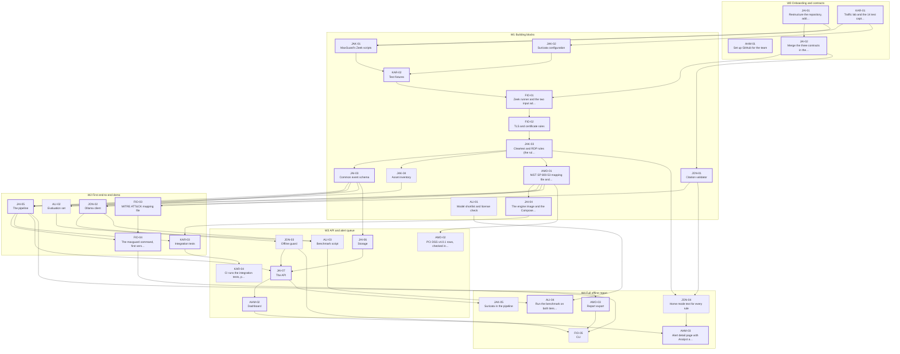

# MaxGuard v2.0 — Roadmap

This folder is the team's build plan for MaxGuard v2.0. It replaces the Fall
2026 roadmap (kept for history in `docs/archive/ROADMAP_fall2026_original.md`).
The locked decisions behind it are in `docs/PROJECT_DECISIONS.md`, the design is
in `docs/ARCHITECTURE.md`, and the hardware lab is in `docs/HARDWARE.md`.

| File | Who |
|---|---|
| [ahmad.md](ahmad.md) | Ahmad — Security Lead; Dashboard, response module |
| [jaiden.md](jaiden.md) | Jaiden — Co-lead; Architecture and Release Lead; Architecture, API, storage, releases |
| [fiona.md](fiona.md) | Fiona — Detection Engine Lead; Engine |
| [jakub.md](jakub.md) | Jakub — Protocol Coverage Engineer; Sensor |
| [jonattan.md](jonattan.md) | Jonattan — Offline AI Engineer; AI |
| [ali.md](ali.md) | Ali — AI Model Evaluation Engineer; AI evaluation |
| [amory.md](amory.md) | Amory — Compliance Mapping Analyst; Mapping and reports |
| [karthik.md](karthik.md) | Karthik — Test and CI Engineer; Testing |

## How to use this roadmap

1. **Start with Week 0** at the top of your own file. Everyone does it, even if
   you already have the tools: it ends with your first merged pull request.
2. **Do your tasks in order.** Each task has an ID such as `JAI-02`. The same ID
   starts the title of its GitHub issue (created by `scripts/create_issues.sh`;
   see `docs/ISSUES.md`), so you can find, assign, and close it on the project
   board. Before you start a task, check **Needs first**: if one of those tasks
   is not merged yet, say so in your issue, help with it, or start your next
   unblocked task.
3. **Every task has the same parts:** goal, prerequisites, exact steps, the code
   or the specification, the commands to run with their expected output, how to
   test it, "what you just did and why", and a pull request checklist.
4. **Four kinds of task.** *Code, tested*: the complete code is in the task and
   was run with its tests during planning, in roadmap order, on a copy of the
   repository holding only the files of the tasks before it — copy it exactly.
   *Code, written*: written in planning, but part of it needs a machine planning
   did not have (the step says which). *Design*: the steps give the files,
   interfaces and tests, and you write the code. *Process*: setup, review,
   testing, or release work with no code.
5. **Milestones are due before the Friday review.** The meeting is for showing
   and reviewing work, not for doing it. If you will miss a date, say so in your
   issue by Wednesday.
6. **Stuck for more than a day?** Post the exact command and the exact error in
   GitHub Discussions (category *Q&A*) and tag your help person (table below).
   Quick chat can stay in Microsoft Teams, but answers others might need go in
   Discussions so they can be searched.
7. **Steps marked "not run — verify on hardware"** (or "not run in planning")
   could not be run while this plan was written. When you run them, fix the
   document in your pull request if anything differs.

### Help people

| Person | Ask first | Then |
|---|---|---|
| Ahmad | Jaiden | — |
| Jaiden | Ahmad | — |
| Fiona | Jaiden | Ahmad |
| Jakub | Fiona | Jaiden |
| Jonattan | Jaiden | Ali |
| Ali | Jonattan | Jaiden |
| Amory | Ahmad (frameworks) | Jonattan (GitHub) |
| Karthik | Jaiden | Fiona |

## Phases and Friday checkpoints

Dates follow the CCSU academic calendar as published in October 2026 (Fall 2026
in full; some Spring 2027 dates were inferred, marked below — confirm at
https://www.ccsu.edu/calendar). Milestone names match the GitHub milestones made
by `scripts/create_issues.sh`.

### Fall 2026 — `v2.0-alpha`

| Week | Friday | Milestone | What must work at the review |
|---|---|---|---|
| W0 | **Oct 9** | `W0 Onboarding and contracts` | Everyone has one merged pull request. GitHub is set up, the repository is restructured, CI runs, the three contracts (v2.0 versions) are merged, and the traffic lab has recorded its 14 captures. |
| W1 | **Oct 16** | `W1 Building blocks` | MaxGuard's Zeek scripts and Suricata settings, the fixtures, both adapters, all 13 rules, the event normalizer, the asset inventory, the citation check, the NIST SP 800-53 mapping file, and the engine image are merged, each with tests. |
| W2 | **Oct 23** | `W2 First end-to-end demo` | **Demo:** `maxguard analyze` on `telnet.pcap` (in the engine image) prints a Telnet finding mapped to NIST SP 800-53 with ATT&CK techniques; on a laptop with Ollama, the same finding gets an explanation whose every sentence cites record IDs. Integration tests run on every lab capture. |
| W3 | **Oct 30** | `W3 API and alert queue` | Upload a capture in the browser; the alert queue shows its findings; storage keeps them; CI runs the integration tests in the engine image; PCI DSS rows are merged. |
| W4 | **Nov 6** | `W4 Full offline report` | Alert detail page with Analyst and Home modes; Suricata runs in the pipeline; JSON, CSV and HTML reports; **a full report is produced with the network unplugged** (the original Fall 2026 gate); the default models are proposed. |
| W5 | **Nov 13** | `W5 Alpha feature freeze` | All alpha features merged; CISA CPG 2.0 and CJIS v6.1 rows merged; the security review is done. After this date: bug fixes only. |
| W6 | **Nov 20** | `W6 Release candidate` | `v2.0-alpha-rc1` is tagged with the offline bundle and handed to an outside tester. |
| W7 | Nov 27 | — | Thanksgiving recess (no classes Nov 25–29; no meeting). Only fixes for the tester's issues. |
| W8 | **Dec 4** | `W8 v2.0-alpha` | `v2.0-alpha` released; the acceptance test below passes; presentation delivered; the hardware lab is built if the parts have arrived. |

Final exams run December 7–13. Winter break (December 14 – January 19) has no
planned work; anything done then is optional.

### Spring 2027 — `v2.0`

Spring classes start Wednesday, January 20, 2027.

| Week | Friday | Milestone | What must work at the review |
|---|---|---|---|
| S1–S4 | Jan 22 – **Feb 12** | `S1-S4 Live sensor` | The Raspberry Pi sensor runs Zeek and Suricata on the mirror port and its logs reach the console every 15 minutes; device attribution; IP timeline and device pages; chain-of-custody log; the live end-to-end check passes. |
| S5–S8 | Feb 19 – **Mar 12** | `S5-S8 Respond` | Blocking with a human in the loop: generated rules, preview before you block (7 days of stored events), approvals with audit and revert, the OPNsense connector; signed intel bundles; the JA4 watchlist; prompt-injection tests and the model re-evaluation. Residence halls close at 5 p.m. on Mar 12: meet early or online. |
| — | Mar 19 | — | Spring break (inferred from residence-hall dates: no meeting). |
| — | Mar 26 | — | Possibly a CCSU recess (Good Friday; not confirmed): no milestone. |
| S9–S11 | Apr 2 – **Apr 16** | `S9-S11 Detect more` | Decoys on their own IP address, per-device baselines, NetFlow/IPFIX input. |
| S12 | **Apr 23** | `S12 v2.0 feature freeze` | The host agent; every v2.0 feature merged. Bug fixes only after this date. |
| S13 | **Apr 30** | `S13 v2.0 release candidate` | `v2.0-rc1` tagged and handed to an outside tester. |
| S14 | **May 7** | `S14 v2.0` | `v2.0` released; the v2.0 acceptance test passes. Final exams start May 10. |

## Who is blocked by whom

The graph shows the tasks up to the Week 4 milestone; an arrow means "must be
merged before". To keep it readable it draws only direct links (if A is needed
by B and B by C, there is no extra arrow from A to C). Thick boxes are on the
critical path. Every task's **Needs first** line in its person file is the full
list, including spring.

The longest chain to the Week 2 demo is **JAI-01 → JAK-01 → KAR-02 → FIO-01 → FIO-02 → JAK-03 → JAI-03 → JAI-05 → FIO-04**. If any of these slips,
the demo slips, so these pull requests are reviewed first (within one day).

How the team avoids waiting:

- Everyone codes against the contracts in `docs/ARCHITECTURE.md` section 5 from
  day one; the code is already in JAI-02.
- The test fixtures (`tests/fixtures/zeek/*`) are real Zeek 9.0.0 and Suricata
  output, so rules, the normalizer, the inventory, and the AI client are tested
  without Docker or a capture.
- Ahmad builds the pages against stores filled from fixtures, so the dashboard
  does not wait for real uploads.

## All tasks by due date

| Due | Task | Owner | Title | Kind |
|---|---|---|---|---|
| W0 | [AHM-01](ahmad.md#ahm-01-set-up-github-for-the-team-access-discussions-labels-milestones-issues) | Ahmad | Set up GitHub for the team: access, Discussions, labels, milestones, issues | process |
| W0 | [JAI-01](jaiden.md#jai-01-restructure-the-repository-add-packaging-and-ci) | Jaiden | Restructure the repository, add packaging and CI | code, tested |
| W0 | [JAI-02](jaiden.md#jai-02-merge-the-three-contracts-in-their-v20-form) | Jaiden | Merge the three contracts in their v2.0 form | code, tested |
| W0 | [KAR-01](karthik.md#kar-01-traffic-lab-and-the-14-test-captures) | Karthik | Traffic lab and the 14 test captures | code, tested |
| W1 | [JAK-01](jakub.md#jak-01-maxguards-zeek-scripts-cleartext-sessions-and-asset-tracking) | Jakub | MaxGuard's Zeek scripts: cleartext sessions and asset tracking | code, tested |
| W1 | [JAK-02](jakub.md#jak-02-suricata-configuration-community-id-and-ja4) | Jakub | Suricata configuration: Community ID and JA4 | code, tested |
| W1 | [KAR-02](karthik.md#kar-02-test-fixtures-zeek-and-suricata-output-for-every-capture) | Karthik | Test fixtures: Zeek and Suricata output for every capture | code, tested |
| W1 | [FIO-01](fiona.md#fio-01-zeek-runner-and-the-two-input-adapters) | Fiona | Zeek runner and the two input adapters | code, tested |
| W1 | [FIO-02](fiona.md#fio-02-tls-and-certificate-rules) | Fiona | TLS and certificate rules | code, tested |
| W1 | [JAK-03](jakub.md#jak-03-cleartext-and-rdp-rules-the-rule-set-is-complete) | Jakub | Cleartext and RDP rules (the rule set is complete) | code, tested |
| W1 | [JAI-03](jaiden.md#jai-03-common-event-schema-the-normalizer-and-record-lookup) | Jaiden | Common event schema: the normalizer and record lookup | code, tested |
| W1 | [JAK-04](jakub.md#jak-04-asset-inventory) | Jakub | Asset inventory | code, tested |
| W1 | [JON-01](jonattan.md#jon-01-citation-validator-no-evidence-no-sentence) | Jonattan | Citation validator: no evidence, no sentence | code, tested |
| W1 | [AMO-01](amory.md#amo-01-nist-sp-800-53-mapping-file-and-the-mapping-checks) | Amory | NIST SP 800-53 mapping file and the mapping checks | code, tested |
| W1 | [JAI-04](jaiden.md#jai-04-the-engine-image-and-the-compose-files) | Jaiden | The engine image and the Compose files | code, written |
| W1 | [ALI-01](ali.md#ali-01-model-shortlist-and-license-check) | Ali | Model shortlist and license check | process |
| W2 | [JAI-05](jaiden.md#jai-05-the-pipeline-one-function-from-input-to-report) | Jaiden | The pipeline: one function from input to report | code, tested |
| W2 | [FIO-03](fiona.md#fio-03-mitre-attck-mapping-file) | Fiona | MITRE ATT&CK mapping file | code, tested |
| W2 | [FIO-04](fiona.md#fio-04-the-maxguard-command-first-version-json-reports) | Fiona | The maxguard command, first version (JSON reports) | code, tested |
| W2 | [JON-02](jonattan.md#jon-02-ollama-client-one-evidence-citing-explanation-per-finding) | Jonattan | Ollama client: one evidence-citing explanation per finding | code, tested |
| W2 | [ALI-02](ali.md#ali-02-evaluation-set-the-same-13-questions-for-every-model) | Ali | Evaluation set: the same 13 questions for every model | code, tested |
| W2 | [KAR-03](karthik.md#kar-03-integration-tests-the-real-pipeline-on-every-capture) | Karthik | Integration tests: the real pipeline on every capture | code, tested |
| W3 | [JAI-06](jaiden.md#jai-06-storage-alerts-in-sqlite-events-in-hourly-parquet-files) | Jaiden | Storage: alerts in SQLite, events in hourly Parquet files | code, tested |
| W3 | [JON-03](jonattan.md#jon-03-offline-guard-make-accidental-network-access-fail-loudly) | Jonattan | Offline guard: make accidental network access fail loudly | code, tested |
| W3 | [JAI-07](jaiden.md#jai-07-the-api-uploads-alerts-events-live-updates-sensor-ingest) | Jaiden | The API: uploads, alerts, events, live updates, sensor ingest | code, tested |
| W3 | [AMO-02](amory.md#amo-02-pci-dss-v401-rows-checked-in-the-official-document) | Amory | PCI DSS v4.0.1 rows, checked in the official document | process |
| W3 | [ALI-03](ali.md#ali-03-benchmark-script-speed-citations-and-unsupported-details) | Ali | Benchmark script: speed, citations, and unsupported details | code, tested |
| W3 | [KAR-04](karthik.md#kar-04-ci-runs-the-integration-tests-plus-a-determinism-test) | Karthik | CI runs the integration tests, plus a determinism test | code, written |
| W3 | [AHM-02](ahmad.md#ahm-02-dashboard-layout-alert-queue-and-upload-page) | Ahmad | Dashboard: layout, alert queue, and upload page | code, tested |
| W4 | [JAK-05](jakub.md#jak-05-suricata-in-the-pipeline) | Jakub | Suricata in the pipeline | code, tested |
| W4 | [AMO-03](amory.md#amo-03-report-export-json-csv-and-html) | Amory | Report export: JSON, CSV, and HTML | code, tested |
| W4 | [FIO-05](fiona.md#fio-05-cli-csv-and-html-reports-and---offline) | Fiona | CLI: CSV and HTML reports, and --offline | code, tested |
| W4 | [JON-04](jonattan.md#jon-04-home-mode-text-for-every-rule) | Jonattan | Home mode text for every rule | code, tested |
| W4 | [AHM-03](ahmad.md#ahm-03-alert-detail-page-with-analyst-and-home-modes) | Ahmad | Alert detail page with Analyst and Home modes | code, tested |
| W4 | [ALI-04](ali.md#ali-04-run-the-benchmark-on-both-tiers-and-propose-the-default-models) | Ali | Run the benchmark on both tiers and propose the default models | process |
| W5 | [JAI-08](jaiden.md#jai-08-ed25519-signing-library) | Jaiden | Ed25519 signing library | code, tested |
| W5 | [AMO-04](amory.md#amo-04-cisa-cpg-20-and-cjis-v61-rows) | Amory | CISA CPG 2.0 and CJIS v6.1 rows | process |
| W5 | [AHM-04](ahmad.md#ahm-04-security-review-of-the-alpha) | Ahmad | Security review of the alpha | process |
| W6 | [JON-05](jonattan.md#jon-05-offline-bundle-install-maxguard-on-a-machine-with-no-internet) | Jonattan | Offline bundle: install MaxGuard on a machine with no internet | code, tested |
| W6 | [JAI-09](jaiden.md#jai-09-release-workflow-and-v20-alpha-rc1) | Jaiden | Release workflow and v2.0-alpha-rc1 | code, tested |
| W6 | [KAR-05](karthik.md#kar-05-release-candidate-test-with-an-outside-tester) | Karthik | Release-candidate test with an outside tester | process |
| W8 | [JAI-10](jaiden.md#jai-10-release-v20-alpha) | Jaiden | Release v2.0-alpha | process |
| W8 | [JAK-06](jakub.md#jak-06-build-the-reference-lab-and-prove-the-mirror-works) | Jakub | Build the reference lab and prove the mirror works | process |
| W8 | [AHM-05](ahmad.md#ahm-05-alpha-acceptance-test-and-presentation) | Ahmad | Alpha acceptance test and presentation | process |
| S4 | [JAK-08](jakub.md#jak-08-device-attribution-which-device-is-behind-each-ip-address) | Jakub | Device attribution: which device is behind each IP address | code, tested |
| S4 | [JAK-07](jakub.md#jak-07-live-sensor-capture-rotation-and-shipping-to-the-console) | Jakub | Live sensor: capture, rotation, and shipping to the console | code, tested |
| S4 | [AMO-05](amory.md#amo-05-chain-of-custody-log) | Amory | Chain-of-custody log | code, tested |
| S4 | [AHM-06](ahmad.md#ahm-06-ip-timeline-and-device-inventory-pages) | Ahmad | IP timeline and device inventory pages | code, tested |
| S4 | [KAR-06](karthik.md#kar-06-end-to-end-test-of-the-live-sensor-on-the-lab) | Karthik | End-to-end test of the live sensor on the lab | code, tested |
| S8 | [JAK-09](jakub.md#jak-09-ja4-watchlist-rule) | Jakub | JA4 watchlist rule | code, tested |
| S8 | [JAI-11](jaiden.md#jai-11-signed-offline-intel-bundles) | Jaiden | Signed offline intel bundles | code, tested |
| S8 | [AHM-07](ahmad.md#ahm-07-response-block-proposals-generated-rules-and-preview-before-you-block) | Ahmad | Response: block proposals, generated rules, and preview before you block | code, tested |
| S8 | [AHM-08](ahmad.md#ahm-08-response-approvals-audit-revert-and-the-opnsense-connector) | Ahmad | Response: approvals, audit, revert, and the OPNsense connector | code, tested |
| S8 | [JON-06](jonattan.md#jon-06-prompt-injection-tests-for-the-ai-layer) | Jonattan | Prompt-injection tests for the AI layer | code, tested |
| S8 | [ALI-05](ali.md#ali-05-re-evaluate-the-models-against-prompt-injection-and-the-spring-rules) | Ali | Re-evaluate the models against prompt injection and the spring rules | process |
| S11 | [FIO-06](fiona.md#fio-06-decoys-fake-services-on-their-own-ip-address) | Fiona | Decoys: fake services on their own IP address | code, tested |
| S11 | [FIO-07](fiona.md#fio-07-per-device-baselines) | Fiona | Per-device baselines | code, tested |
| S11 | [JAK-10](jakub.md#jak-10-netflow-and-ipfix-input) | Jakub | NetFlow and IPFIX input | code, tested |
| S12 | [JAK-11](jakub.md#jak-11-host-agent-for-one-computer) | Jakub | Host agent for one computer | code, tested |
| S13 | [JAI-12](jaiden.md#jai-12-release-v20-rc1-and-v20) | Jaiden | Release v2.0-rc1 and v2.0 | process |
| S14 | [AHM-09](ahmad.md#ahm-09-v20-acceptance-test) | Ahmad | v2.0 acceptance test | process |

## Acceptance test for `v2.0-alpha` (Friday, December 4)

Run by someone who did not build the release, on a machine that has never run
MaxGuard. Ahmad records each result (AHM-05).

1. On a clean machine with only Docker installed, download every file of the
   GitHub Release (the offline bundle) into one empty folder.
2. Verify the checksums (`sha256sum -c SHA256SUMS` on Linux,
   `shasum -a 256 -c SHA256SUMS` on macOS): every part prints `OK`.
3. Nothing to reassemble or unpack: `install.sh` joins the parts itself.
4. **Disconnect the network** (Wi-Fi off, cable out). Check that
   `ping -c 1 1.1.1.1` fails.
5. Run `bash install.sh`. It finishes without errors.
6. Open http://127.0.0.1:8000. The dashboard loads and shows the privacy note.
7. Upload `sample-telnet.pcap` from the bundle. The alert queue shows a
   `cleartext.telnet` alert mapped to controls in all four frameworks, with
   ATT&CK techniques and a local AI explanation whose sentences cite record IDs.
8. Upload `sample-telnet-zeek-logs.tar.gz`. A report appears (the log-import path works).
9. Download the JSON, CSV, and HTML reports. All three open and contain the same findings.
10. Upload `sample-clean-tls13.pcap`. It produces zero findings.

The `v2.0` acceptance test (May 7, AHM-09) adds: the live sensor on the
reference lab, a blocked IP address with preview, approval and revert, a
verified intel bundle, and the chain-of-custody check.

## Labels used on issues

| Label | Meaning |
|---|---|
| `owner:<name>` | Who does it (`owner:ahmad`, `owner:jaiden`, ...) |
| `phase:alpha`, `phase:spring` | Which release it belongs to |
| `type:task`, `type:bug`, `type:question`, `type:docs` | Kind of issue |
| `area:engine`, `area:ai`, `area:mapping`, `area:ui`, `area:api`, `area:storage`, `area:sensor`, `area:response`, `area:testing`, `area:release`, `area:program` | Part of the system |
| `critical-path` | A delay here delays the next demo or release |
| `contract-change` | Changes a contract: needs Jaiden's review and the Security Lead's approval |
| `blocked` | Waiting on another task (say which in a comment) |
| `needs-hardware` | Contains steps marked "not run — verify on hardware" |
